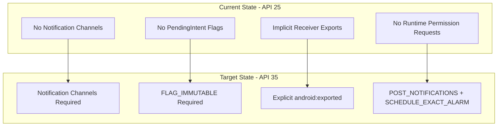

# Android 15 (API 35) Update Plan

## Overview

Update targetSdkVersion from 25 to 35 - jumping 10 API levels. This requires addressing breaking changes from Android 8 through 15.

## Architecture Impact



---

## Phase 1: Notification Channels (API 26+ Requirement)

**Why**: Without channels, notifications silently fail on Android 8+

### Files to Modify

1. **Create new file**: `NotificationChannels.kt` - centralized channel management

   - Define channel IDs as constants
   - Create channels on app startup
   - Handle channel creation idempotently

2. **[GlobalState.kt](android/app/src/main/java/com/github/quarck/calnotify/GlobalState.kt)** - call channel creation in `onCreate()`

3. **[EventNotificationManager.kt](android/app/src/main/java/com/github/quarck/calnotify/notification/EventNotificationManager.kt)** - update all 6 `NotificationCompat.Builder` calls to include channel ID

### Channel Structure (from existing strings)

- `calendar_events` - Default channel for events
- `calendar_alarm` - Alarm-priority notifications  
- `calendar_silent` - Silent/muted notifications
- `calendar_reminders` - Reminder notifications
- `calendar_alarm_reminders` - Alarm-priority reminders

---

## Phase 2: PendingIntent Flags (API 31+ Requirement)

**Why**: Apps crash if PendingIntent doesn't specify mutability on Android 12+

### Files to Modify

1. **[SystemUtils.kt](android/app/src/main/java/com/github/quarck/calnotify/utils/SystemUtils.kt)** - alarm scheduling PendingIntents

2. **[CalendarMonitor.kt](android/app/src/main/java/com/github/quarck/calnotify/calendarmonitor/CalendarMonitor.kt)** - monitoring PendingIntents

3. **[EventNotificationManager.kt](android/app/src/main/java/com/github/quarck/calnotify/notification/EventNotificationManager.kt)** - notification action PendingIntents

### Approach

- Add `FLAG_IMMUTABLE` to all PendingIntents (they don't need to be modified after creation)
- Create helper function to build flags with backward compatibility:
```kotlin
val pendingIntentFlags = if (Build.VERSION.SDK_INT >= 31) {
    PendingIntent.FLAG_UPDATE_CURRENT or PendingIntent.FLAG_IMMUTABLE
} else {
    PendingIntent.FLAG_UPDATE_CURRENT
}
```


---

## Phase 3: Manifest Updates (API 31+ Requirements)

### 3a. Explicit Receiver Exports

**[AndroidManifest.xml](android/app/src/main/AndroidManifest.xml)** - Add `android:exported="true"` to all receivers with intent-filters:

- `EventReminderBroadcastReceiver` (system calendar intents)
- `CalendarChangedBroadcastReceiver` (system provider change)
- `TimeSetBroadcastReceiver` (system time intents)
- `RemoteCommandBroadcastReceiver` (already has tools:ignore, needs exported)

Internal receivers (no intent-filters) need `android:exported="false"`:

- `SnoozeAlarmBroadcastReceiver`
- `ReminderAlarmBroadcastReceiver`
- `ManualEventAlarmBroadcastReceiver`
- `SnoozeExactAlarmBroadcastReceiver`
- `ReminderExactAlarmBroadcastReceiver`
- `ManualEventExactAlarmBroadcastReceiver`
- `ManualEventAlarmPeriodicRescanBroadcastReceiver`
- `RescheduleConfirmationsBroadcastReceiver`

### 3b. New Permissions

Add to manifest:

```xml
<!-- Android 13+ (API 33) -->
<uses-permission android:name="android.permission.POST_NOTIFICATIONS" />

<!-- Android 12+ (API 31) - for calendar/alarm apps -->
<uses-permission android:name="android.permission.USE_EXACT_ALARM" />
```

Note: `USE_EXACT_ALARM` (not `SCHEDULE_EXACT_ALARM`) is appropriate for calendar apps and is auto-granted.

---

## Phase 4: Runtime Permission Handling (API 33+)

### Files to Modify

1. **[PermissionsManager.kt](android/app/src/main/java/com/github/quarck/calnotify/permissions/PermissionsManager.kt)** - add notification permission check/request

2. **[MainActivity.kt](android/app/src/main/java/com/github/quarck/calnotify/ui/MainActivity.kt)** - request POST_NOTIFICATIONS on first launch (API 33+)

### Logic

```kotlin
fun hasNotificationPermission(context: Context): Boolean {
    return if (Build.VERSION.SDK_INT >= 33) {
        ContextCompat.checkSelfPermission(context, 
            Manifest.permission.POST_NOTIFICATIONS) == PackageManager.PERMISSION_GRANTED
    } else true
}
```

---

## Phase 5: SDK Version Bump

### [android/app/build.gradle](android/app/build.gradle)

```groovy
android {
    compileSdkVersion 35  // was 34
    
    defaultConfig {
        targetSdkVersion 35  // was 25
    }
}
```

### [android/build.gradle](android/build.gradle)

May need to update Android Gradle Plugin if current version doesn't support API 35.

---

## Phase 6: Testing Strategy

Given your test-first approach:

1. **Unit tests** for new permission checking logic
2. **Unit tests** for notification channel creation
3. **Instrumentation tests** across multiple API levels:

   - API 30 (Android 11) - pre-notification permission
   - API 33 (Android 13) - notification permission required
   - API 34/35 (Android 14/15) - full compliance

---

## Risk Assessment

| Risk | Mitigation |

|------|------------|

| Notifications fail silently | Create channels before any notification is posted |

| PendingIntent crashes | Add flags with version check for backward compat |

| Permission denied flows | Graceful UI explaining why permissions are needed |

| Alarm reliability | USE_EXACT_ALARM auto-grants for calendar apps |

---

## Recommended Order of Implementation

The phases should be implemented in order (1-5), as each builds on the previous. Phase 6 (testing) should run in parallel throughout.

**Estimated total effort**: Medium-High (significant changes across many files, but mostly mechanical)