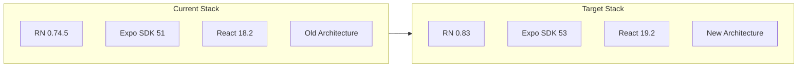

# React Native 0.83 Upgrade Plan

This is a significant upgrade spanning multiple React Native versions. The plan is structured in phases with validation checkpoints to catch issues early.

## Architecture Overview



---

## Phase 1: Compatibility Research (Pre-requisite)

**Goal:** Verify all critical dependencies support RN 0.83 and New Architecture before committing.

### 1.1 Check PowerSync Compatibility

- Visit [PowerSync GitHub](https://github.com/powersync-ja/powersync-js) and check their React Native support matrix
- Verify `@powersync/react-native` works with RN 0.83 and New Architecture
- Check if `@powersync/op-sqlite` adapter supports New Architecture
- **Blocker if not supported** - would need to wait or find alternative

### 1.2 Check op-sqlite Compatibility  

- Verify `@op-engineering/op-sqlite` v11+ supports New Architecture
- Check their migration guide for any breaking changes

### 1.3 Check Other Key Dependencies

- `@gluestack-ui/themed` - verify Expo SDK 53 compatibility
- `react-navigation` v6 - check if upgrade to v7 is required
- `react-native-screens`, `react-native-safe-area-context` - verify versions for RN 0.83

### Checkpoint 1

- All critical dependencies confirmed compatible
- Document any required dependency version bumps
- Decision: proceed or adjust target version

---

## Phase 2: Branch and Package Updates

**Goal:** Update all JavaScript dependencies and resolve version conflicts.

### 2.1 Create Upgrade Branch

```bash
git checkout -b feature/rn-083-upgrade
```

### 2.2 Update Core Packages in [package.json](package.json)

Key version changes needed:

```json
{
  "react": "19.0.0",
  "react-native": "0.83.x",
  "expo": "~53.0.0",
  "@react-native/metro-config": "^0.83.0",
  "@react-native/metro-babel-transformer": "^0.83.0",
  "@react-native/js-polyfills": "^0.83.0"
}
```

### 2.3 Update Expo-Related Packages

- Run `npx expo install --fix` to auto-resolve Expo SDK 53 compatible versions
- Update `jest-expo` to match SDK 53

### 2.4 Resolve Dependency Conflicts

- Run `yarn install` and resolve peer dependency warnings
- May need to update gluestack, react-navigation, etc.

### Checkpoint 2

- `yarn install` completes without errors
- No critical peer dependency warnings

---

## Phase 3: Android Build Configuration

**Goal:** Update Gradle and native build files for RN 0.83.

### 3.1 Update [android/build.gradle](android/build.gradle)

Expected changes:

- Update `kotlin_version` if required by RN 0.83
- Update `android_gradle_plugin_version` (likely 8.6+)
- Update `compileSdkVersion` / `targetSdkVersion` if RN requires higher
- Update React Native Gradle Plugin references

### 3.2 Update [android/app/build.gradle](android/app/build.gradle)

Key changes:

- Add New Architecture configuration flags
- Update `react {}` block for new plugin API
- May need to update `compileOptions` for Java 17+

### 3.3 Update [android/settings.gradle](android/settings.gradle)

- Update `includeBuild` path for new RN gradle plugin location
- Update autolinking configuration for Expo SDK 53

### 3.4 Update [metro.config.js](metro.config.js)

- Apply any breaking changes from Metro bundler updates
- Update resolver configuration if needed

### Checkpoint 3

- `cd android && ./gradlew clean` succeeds
- No Gradle configuration errors

---

## Phase 4: New Architecture Enablement

**Goal:** Enable and configure the New Architecture (Fabric + TurboModules).

### 4.1 Enable New Architecture

In `android/gradle.properties` (or create if missing):

```properties
newArchEnabled=true
```

Note: RN 0.83 has New Architecture ON by default, but explicit setting helps with debugging.

### 4.2 Verify Native Module Compatibility

Your app has native Kotlin code in `android/app/src/main/kotlin/`. Check if any native modules need TurboModule conversion:

- Review any `ReactContextBaseJavaModule` implementations
- These may need to be converted to TurboModules

### 4.3 Test Hermes Integration

- Hermes is already enabled in your [app.json](app.json)
- Verify Hermes works with New Architecture build

### Checkpoint 4

- App builds with New Architecture enabled
- No native module crashes on startup

---

## Phase 5: CR-SQLite Rebuild

**Goal:** Rebuild cr-sqlite native libraries for updated NDK/build tools.

### 5.1 Check NDK Requirements

Current NDK in [android/build.gradle](android/build.gradle):

```groovy
ndkVersion = '26.1.10909125'
```

- Verify if RN 0.83 requires different NDK version
- If changed, cr-sqlite must be rebuilt

### 5.2 Rebuild cr-sqlite (if needed)

```bash
yarn build:crsqlite:arm64
```

Follow [docs/CR_SQLITE_BUILD.md](docs/CR_SQLITE_BUILD.md) for rebuild process.

### Checkpoint 5

- Native SQLite libraries load correctly
- PowerSync database operations work

---

## Phase 6: Code Updates

**Goal:** Update application code for React 19 and any API changes.

### 6.1 React 19 Breaking Changes

Review and update if needed:

- `useRef` now requires explicit `null` initial value
- `forwardRef` no longer needed (ref is a prop)
- Cleanup functions in `useEffect` behavior changes
- Check [index.tsx](index.tsx) and components in [app/](app/)

### 6.2 React Navigation Updates

- Check if navigation API has breaking changes
- Update screen options if needed

### 6.3 PowerSync API Updates

- Check for any API changes in newer PowerSync versions
- Update [lib/powersync/](lib/powersync/) if needed

### Checkpoint 6

- TypeScript compilation passes
- No runtime errors on app launch

---

## Phase 7: Testing and Validation

**Goal:** Ensure all functionality works correctly after upgrade.

### 7.1 Run JavaScript Tests

```bash
yarn test
```

- Fix any Jest/testing-library breaking changes

### 7.2 Build and Install Debug APK

```bash
yarn android:build:debug
```

### 7.3 Manual Testing Checklist

- [ ] App launches without crash
- [ ] Navigation between screens works
- [ ] PowerSync connection and sync works
- [ ] Settings persist correctly
- [ ] Theme switching works (light/dark)

### 7.4 Run Android Instrumentation Tests

- Verify existing test suite passes
- Fix any test framework compatibility issues

### Checkpoint 7

- All tests pass
- Manual testing confirms functionality

---

## Rollback Strategy

If critical issues are found:

1. Document the issue and which phase it occurred in
2. Check if it's a known issue with workarounds
3. If not resolvable, consider intermediate version (e.g., RN 0.79)
4. `git checkout master` to return to working state

---

## Key Files to Monitor

| File | Changes Expected |

|------|------------------|

| [package.json](package.json) | Major version bumps |

| [android/build.gradle](android/build.gradle) | Gradle plugin, Kotlin, SDK versions |

| [android/app/build.gradle](android/app/build.gradle) | Build config, New Arch flags |

| [android/settings.gradle](android/settings.gradle) | Plugin paths, autolinking |

| [metro.config.js](metro.config.js) | Bundler config updates |

| [index.tsx](index.tsx) | React 19 API changes |

| [babel.config.js](babel.config.js) | Babel preset updates |

---

## Risk Mitigation

1. **PowerSync is critical** - Phase 1 research must confirm compatibility before proceeding
2. **Keep commits small** - One logical change per commit for easy bisecting
3. **Test after each phase** - Don't stack changes before validating
4. **Document issues** - Add to `docs/dev_completed/` as you solve problems