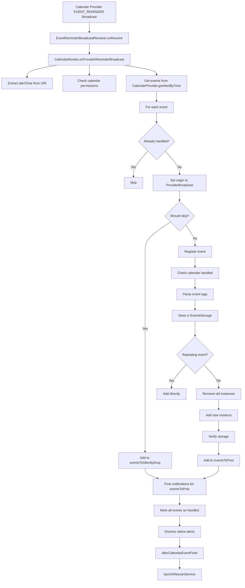
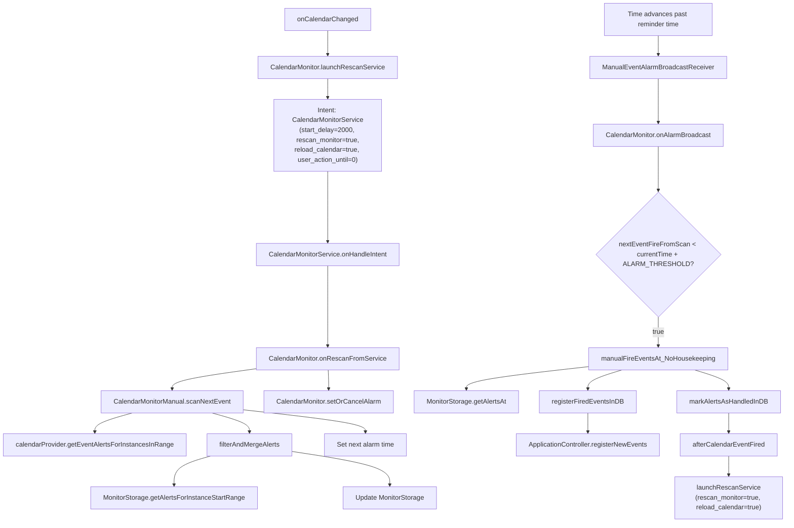

# How Calendar Monitoring works

## testCalendarMonitoringDirectReminder

Follows `android.intent.action.EVENT_REMINDER` through the code to registerNewEvent

```
Calendar Provider EVENT_REMINDER Broadcast
    │
    ▼
EventReminderBroadcastReceiver.onReceive
    │
    ▼
CalendarMonitor.onProviderReminderBroadcast
    │
    ├──► CalendarMonitor.onProviderReminderBroadcast: Extract alertTime from URI
    │
    ├──► CalendarMonitor.onProviderReminderBroadcast: Check calendar permissions via PermissionsManager.hasAllCalendarPermissionsNoCache
    │
    ├──► CalendarMonitor.onProviderReminderBroadcast: Get events from CalendarProvider.getAlertByTime
    │
    ├──► CalendarMonitor.onProviderReminderBroadcast: For each event:
    │    │
    │    ├──► CalendarMonitor.getAlertWasHandled: Check if already handled
    │    │
    │    ├──► CalendarMonitor.onProviderReminderBroadcast: Set origin to ProviderBroadcast
    │    │
    │    ├──► ApplicationController.shouldMarkEventAsHandledAndSkip: Check if should skip
    │    │    │
    │    │    ├──► Check if event is cancelled and user ignores cancelled events
    │    │    ├──► Check if event is declined and user ignores declined events
    │    │    └──► Check if event is all-day and user ignores all-day events
    │    │
    │    ├──► ApplicationController.registerNewEvent: If not skipped, register event
    │    │    │
    │    │    ├──► Check if calendar is handled by app
    │    │    ├──► TagsManager.parseEventTags: Parse event tags
    │    │    ├──► EventsStorage.addEvent: Store in EventsStorage
    │    │    │    │
    │    │    │    ├──► For repeating events: add directly
    │    │    │    └──► For non-repeating: remove old instances first
    │    │    │
    │    │    └──► EventsStorage.getEvent: Verify event was stored correctly
    │    │
    │    └──► CalendarMonitor.onProviderReminderBroadcast: Add to eventsToPost or eventsToSilentlyDrop
    │
    ├──► ApplicationController.postEventNotifications: Post notifications for eventsToPost
    │
    ├──► CalendarMonitor.setAlertWasHandled: Mark eventsToSilentlyDrop as handled
    │
    ├──► CalendarProvider.dismissNativeEventAlert: Dismiss native alerts for eventsToSilentlyDrop
    │
    ├──► CalendarMonitor.setAlertWasHandled: Mark eventsToPost as handled
    │
    ├──► CalendarProvider.dismissNativeEventAlert: Dismiss native alerts for eventsToPost
    │
    ├──► ApplicationController.afterCalendarEventFired: Reschedule alarms and notify UI
    │
    └──► CalendarMonitor.launchRescanService: Trigger rescan service
```



Note: The broadcast receiver for EVENT_REMINDER is registered with the highest possible priority (2147483647) to ensure reliable event handling.

## testCalendarMonitoringManualRescan

Follows `android.intent.action.PROVIDER_CHANGED` through the code to registerNewEvent

```
onCalendarChanged
    │
    ▼
CalendarMonitor.launchRescanService
    │
    ├──► Intent[CalendarMonitorService]
    │    Parameters:
    │    - start_delay=2000
    │    - rescan_monitor=true
    │    - reload_calendar=true
    │    - user_action_until=0
    │
    ▼
CalendarMonitorService.onHandleIntent
    │
    ├──► CalendarMonitor.onRescanFromService
    │    │
    │    ├──► CalendarMonitorManual.scanNextEvent
    │    │    │
    │    │    ├──► calendarProvider.getEventAlertsForInstancesInRange
    │    │    │
    │    │    ├──► filterAndMergeAlerts
    │    │    │    │
    │    │    │    ├──► MonitorStorage.getAlertsForInstanceStartRange
    │    │    │    │
    │    │    │    └──► Update MonitorStorage with new/disappeared alerts
    │    │    │
    │    │    └──► Set next alarm time
    │    │
    │    └──► CalendarMonitor.setOrCancelAlarm
    │
    ▼
Time advances past reminder time
    │
    ▼
ManualEventAlarmBroadcastReceiver receives alarm
    │
    ├──► CalendarMonitor.onAlarmBroadcast
    │    │
    │    ├──► Check timing condition
    │    │    (nextEventFireFromScan < currentTime + ALARM_THRESHOLD)
    │    │
    │    ├──► CalendarMonitorManual.manualFireEventsAt_NoHousekeeping
    │    │    │
    │    │    ├──► MonitorStorage.getAlertsAt/getAlertsForAlertRange
    │    │    │
    │    │    ├──► registerFiredEventsInDB
    │    │    │    │
    │    │    │    └──► ApplicationController.registerNewEvents
    │    │    │
    │    │    └──► markAlertsAsHandledInDB
    │    │
    │    ├──► ApplicationController.afterCalendarEventFired (if events fired)
    │    │
    │    └──► launchRescanService
    │         Parameters:
    │         - rescan_monitor=true
    │         - reload_calendar=true
```

Note: The CalendarMonitorService uses a wake lock during the rescan process to ensure reliable operation, especially when processing calendar changes and firing events.



## Additional Calendar Monitoring Triggers

Besides the two main flows above, the Calendar Monitor can be triggered through several other paths:

### System Boot

```
BOOT_COMPLETED Broadcast
    │
    ▼
BootCompleteBroadcastReceiver.onReceive
    │
    ▼
ApplicationController.onBootComplete
    │
    ├──► Post notifications for existing events
    │
    ├──► Reschedule alarms
    │
    ▼
CalendarMonitor.launchRescanService
    (Same flow as PROVIDER_CHANGED)
```

### Application Update

```
MY_PACKAGE_REPLACED Broadcast
    │
    ▼
AppUpdatedBroadcastReceiver.onReceive
    │
    ▼
ApplicationController.onAppUpdated
    │
    ├──► Post notifications for existing events
    │
    ├──► Reschedule alarms
    │
    ▼
CalendarMonitor.launchRescanService
    (Same flow as PROVIDER_CHANGED)
```

### Time or Timezone Changes

```
TIME_SET or TIMEZONE_CHANGED Broadcast
    │
    ▼
TimeSetBroadcastReceiver.onReceive
    │
    ▼
ApplicationController.onTimeChanged
    │
    ├──► alarmScheduler.rescheduleAlarms
    │
    ▼
CalendarMonitor.onSystemTimeChange
    │
    ▼
CalendarMonitor.launchRescanService
    (Same flow as PROVIDER_CHANGED)
```

### Periodic Rescan

```
System-scheduled Alarm
    │
    ▼
ManualEventAlarmPeriodicRescanBroadcastReceiver.onReceive
    │
    ▼
CalendarMonitor.onPeriodicRescanBroadcast
    │
    ▼
CalendarMonitor.launchRescanService
    (Same flow as PROVIDER_CHANGED)
```
