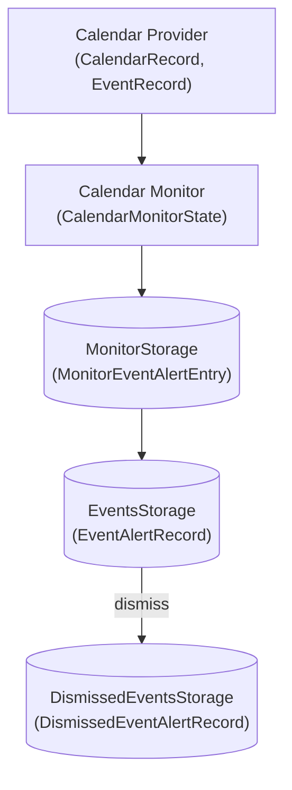
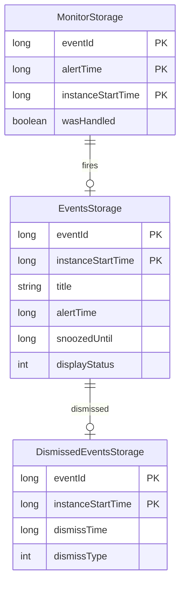
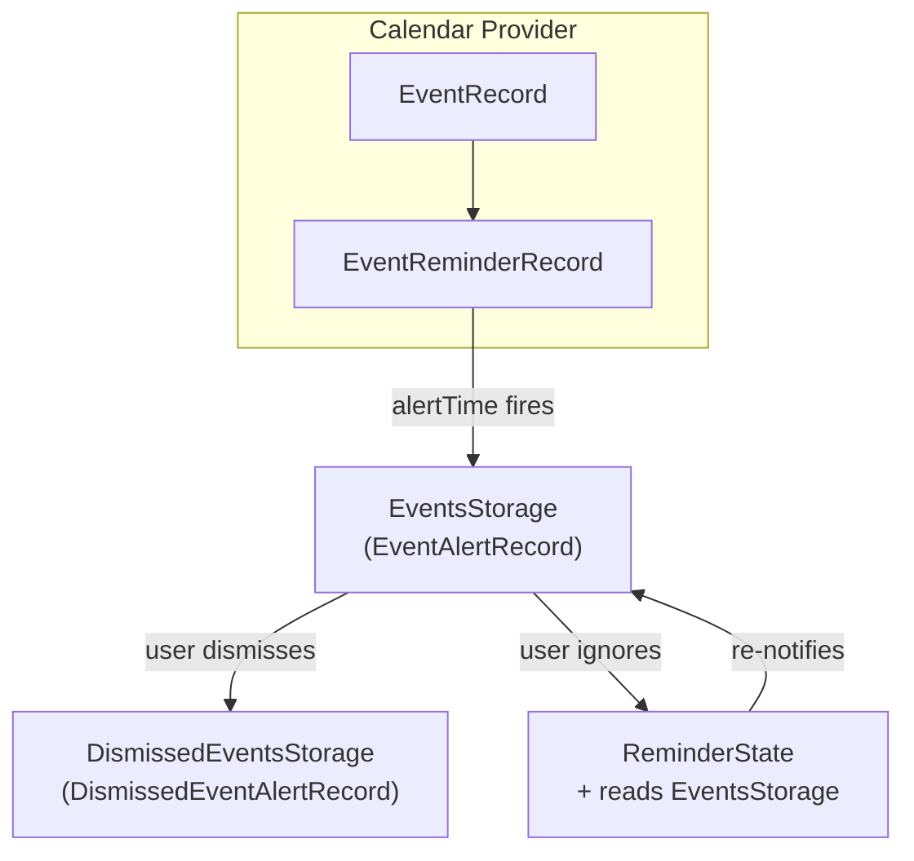
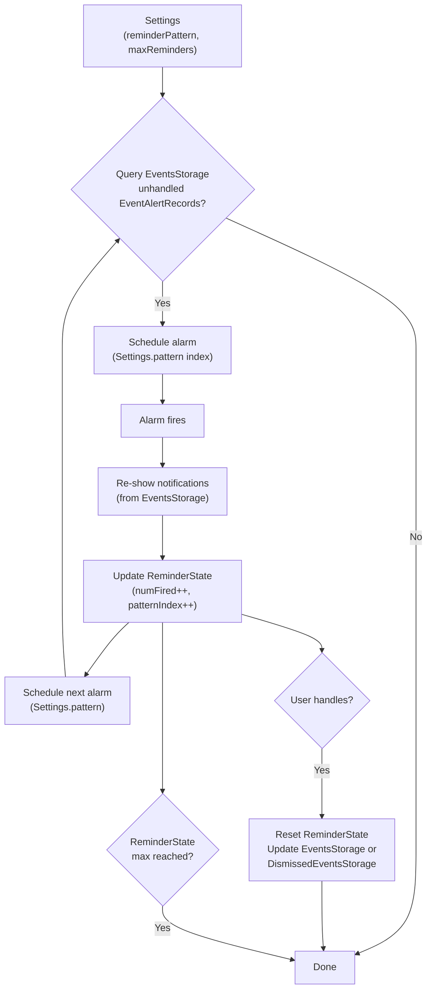

# Domain Model

## Quick Reference

**Storage (Room databases):**
| Storage | Domain Class | Database | Table |
|---------|--------------|----------|-------|
| `EventsStorage` | `EventAlertRecord` | `RoomEvents` | `eventsV9` |
| `DismissedEventsStorage` | `DismissedEventAlertRecord` | `RoomDismissedEvents` | `dismissedEventsV2` |
| `MonitorStorage` | `MonitorEventAlertEntry` | `RoomCalendarMonitor` | `manualAlertsV1` |

**External (Calendar Provider):**
- `CalendarRecord` - calendar account info
- `EventRecord` - full event with `EventReminderRecord` list

**State (SharedPreferences):**
- `Settings` - user preferences
- `PersistentState` - app runtime state
- `ReminderState` - missed event reminder tracking
- `CalendarMonitorState` - calendar scan state
- `BTCarModeStorage` - bluetooth triggers

---

## Overview

Core domain concepts in Calendar Notifications Plus and how they relate to each other.

## Data Flow

```
┌─────────────────────────────────────────┐
│           Calendar Provider              │
│  (Google Calendar, Exchange, etc.)       │
│                                          │
│  Entities: CalendarRecord, EventRecord   │
└────────────────────┬────────────────────┘
                     │ queried by CalendarProvider wrapper
                     ▼
┌─────────────────────────────────────────┐
│            Calendar Monitor              │
│     (watches for alerts that should fire)│
│                                          │
│  State: CalendarMonitorState             │
└─────────────┬───────────────────────────┘
              │ tracks upcoming alerts in
              ▼
┌──────────────────────────┐
│   MonitorStorage         │
│                          │
│  Entity: MonitorEventAlertEntry
└──────────────────────────┘
              │ when alert fires, creates
              ▼
┌──────────────────────────┐         ┌──────────────────────────┐
│   EventsStorage          │         │   DismissedEventsStorage │
│                          │  ────►  │                          │
│  Entity: EventAlertRecord│ dismiss │  Entity: DismissedEventAlertRecord
└──────────────────────────┘         └──────────────────────────┘
```

<details>
<summary>Mermaid version</summary>



</details>

## Domain Concepts

### Calendar Events (External)

**Source:** Android Calendar Provider (not stored by us)

These are the actual calendar events on the user's device. We query them but don't own them.

Query types:
- `CalendarRecord` - calendar account (id, owner, displayName, color)
- `EventRecord` - full event details (used to populate/update EventAlertRecord)

### Event Alerts (EventsStorage)

**What it is:** An active notification that the app is managing.

**Lifecycle:** Created when an alert fires → Displayed to user → Snoozed or Dismissed

**Snoozing:** When snoozed, `snoozedUntil` is set to the wake time. An alarm reschedules the notification. The alert stays in EventsStorage (not moved to DismissedEventsStorage).

```kotlin
data class EventAlertRecord(
    // Identity
    val eventId: Long,
    val instanceStartTime: Long,  // For recurring events, identifies which instance
    
    // Event data (snapshot from calendar)
    val title: String,
    val desc: String,
    val location: String,
    val startTime: Long,
    val endTime: Long,
    val isAllDay: Boolean,
    val isRepeating: Boolean,
    val color: Int,
    
    // Alert state (our data)
    val alertTime: Long,
    val notificationId: Int,
    val snoozedUntil: Long,
    val displayStatus: EventDisplayStatus,
    val lastStatusChangeTime: Long,
    // ...
)
```

**Storage:** `EventsStorage` (Room: `eventsV9` table)

### Dismissed Event Alerts (DismissedEventsStorage)

**What it is:** A record that the user dismissed an alert.

**Purpose:** Undo support, preventing duplicate notifications.

```kotlin
data class DismissedEventAlertRecord(
    val event: EventAlertRecord,  // The dismissed event's data
    val dismissTime: Long,
    val dismissType: EventDismissType
)
```

**Storage:** `DismissedEventsStorage` (Room: `dismissedEventsV2` table)

### Monitor Alerts (MonitorStorage)

**What it is:** Alerts being tracked for manual calendar scanning mode.

**Context:** Android's `EVENT_REMINDER` broadcasts can be unreliable. Manual scan mode proactively queries the calendar and tracks upcoming alerts.

```kotlin
data class MonitorEventAlertEntry(
    val eventId: Long,
    val alertTime: Long,
    val instanceStartTime: Long,
    val instanceEndTime: Long,
    val isAllDay: Boolean,
    val alertCreatedByUs: Boolean,
    val wasHandled: Boolean
)
```

**Storage:** `MonitorStorage` (Room: `manualAlertsV1` table)

## Relationships

```
┌─────────────────┐      ┌─────────────────┐      ┌─────────────────────┐
│ MonitorStorage  │      │  EventsStorage  │      │DismissedEventsStorage│
├─────────────────┤      ├─────────────────┤      ├─────────────────────┤
│ eventId (PK)    │      │ eventId (PK)    │      │ eventId (PK)        │
│ alertTime (PK)  │─────►│ instanceStart(PK)│─────►│ instanceStart (PK)  │
│ instanceStart(PK)│      │ title           │      │ dismissTime         │
│ wasHandled      │      │ alertTime       │      │ dismissType         │
└─────────────────┘      │ snoozedUntil    │      └─────────────────────┘
                         │ displayStatus   │
                         └─────────────────┘
```

<details>
<summary>Mermaid version</summary>



</details>

## Naming Conventions

| Concept | Domain Class | Room Entity | Storage |
|---------|--------------|-------------|---------|
| Active notification | `EventAlertRecord` | `EventAlertEntity` | `EventsStorage` |
| Dismissed notification | `DismissedEventAlertRecord` | `DismissedEventEntity` | `DismissedEventsStorage` |
| Monitored upcoming alert | `MonitorEventAlertEntry` | `MonitorAlertEntity` | `MonitorStorage` |

## Supporting Types

### Enums

| Enum | Purpose |
|------|---------|
| `EventDisplayStatus` | Hidden, DisplayedNormal, DisplayedCollapsed |
| `EventDismissType` | How alert was dismissed (manual, auto, etc.) |
| `EventOrigin` | How alert was created (broadcast vs manual scan) |
| `EventStatus` | Calendar event status (Tentative, Confirmed, Cancelled) |
| `AttendanceStatus` | User's RSVP status |

## Persistent State (SharedPreferences)

| Class | Purpose |
|-------|---------|
| `Settings` | User preferences (theme, sounds, snooze durations) |
| `PersistentState` | App state (last notification time, snooze alarms) |
| `ReminderState` | Reminder firing state (fire count, pattern index) |
| `CalendarMonitorState` | Scan state (next fire time, first scan flag) |
| `BTCarModeStorage` | Bluetooth car mode trigger devices |

## Alert & Reminder Flow

Two different "reminder" concepts:

```
┌─────────────────────────────────────────────────────────────────────────────┐
│                           CALENDAR PROVIDER                                  │
│  Event: "Meeting at 10:00am"                                                │
│  Reminders: [15 min before, 1 hour before]                                  │
│                                                                             │
│  Entities: EventRecord, EventReminderRecord                                 │
└─────────────────────────────────────────────────────────────────────────────┘
                                    │
                                    │ Android fires EVENT_REMINDER broadcast
                                    │ at alertTime (e.g., 9:45am, 9:00am)
                                    ▼
┌─────────────────────────────────────────────────────────────────────────────┐
│                           EventsStorage                                      │
│  EventAlertRecord created with:                                              │
│    - alertTime = when reminder fired                                        │
│    - snoozedUntil = 0 (not snoozed)                                         │
│    - displayStatus = DisplayedNormal                                        │
│                                                                             │
│  Entity: EventAlertRecord                                                   │
└─────────────────────────────────────────────────────────────────────────────┘
                                    │
                    ┌───────────────┴───────────────┐
                    ▼                               ▼
            User dismisses                  User ignores
                    │                               │
                    ▼                               ▼
        ┌─────────────────────────┐     ┌───────────────────────────┐
        │ DismissedEventsStorage  │     │ MISSED EVENT REMINDERS    │
        │                         │     │                           │
        │ Entity:                 │     │ State: ReminderState      │
        │ DismissedEventAlertRecord     │ Reads: EventsStorage      │
        └─────────────────────────┘     │                           │
                                        │ Re-notifies at intervals  │
                                        │ until user handles alert  │
                                        └───────────────────────────┘
```

<details>
<summary>Mermaid version</summary>



</details>

**Calendar Reminders** (`EventReminderRecord`): Configured in calendar app. Define WHEN an alert fires (e.g., "15 min before"). Stored in Calendar Provider, not by us.

**Missed Event Reminders** (`ReminderState`): App feature that re-notifies about unhandled alerts.

```
┌─────────────────────────────────────────────────────────────────────────────┐
│                    MISSED EVENT REMINDERS FLOW                              │
│                                                                             │
│  Reads: Settings (reminderPattern = [10m, 30m, 1h], maxReminders = 5)      │
└─────────────────────────────────────────────────────────────────────────────┘
                                    │
                                    ▼
┌─────────────────────────────────────────────────────────────────────────────┐
│  Query: EventsStorage for unhandled EventAlertRecords                       │
│    (where snoozedUntil = 0 and not dismissed)                               │
│                                                                             │
│    YES → Schedule Android alarm for pattern[currentIndex]                   │
│    NO  → Done                                                               │
└─────────────────────────────────────────────────────────────────────────────┘
                                    │
                                    ▼ (alarm fires)
┌─────────────────────────────────────────────────────────────────────────────┐
│  ReminderAlarmBroadcastReceiver                                             │
│                                                                             │
│  Reads: EventsStorage (EventAlertRecords to re-notify)                      │
│  Reads: Settings (pattern intervals, max reminders)                         │
│  Updates: ReminderState                                                     │
│       - numRemindersFired++                                                 │
│       - currentReminderPatternIndex++ (wraps at end)                        │
│       - reminderLastFireTime = now                                          │
│                                                                             │
│  Then: Schedule next alarm using Settings.pattern[newIndex]                 │
└─────────────────────────────────────────────────────────────────────────────┘
                                    │
                    ┌───────────────┴───────────────┐
                    ▼                               ▼
          User handles alert              ReminderState.numRemindersFired >= max
          (dismiss/snooze)                        │
                    │                               ▼
                    ▼                          Stop reminding
          Updates: ReminderState
            - currentIndex = 0
            - numFired = 0
          Updates: EventsStorage or DismissedEventsStorage
```

<details>
<summary>Mermaid version</summary>



</details>

### Cloud Sync (Optional)

Unidirectional backup to cloud via PowerSync/Supabase. Room databases use cr-sqlite extension enabling sync capability. See [Data Sync Guide](../DATA_SYNC_README.md).
