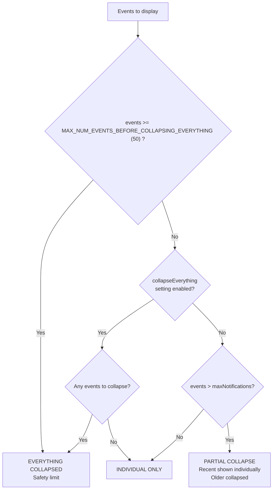

# Notification Architecture

## Overview

This document describes the notification system in Calendar Notifications Plus, including notification channels, posting modes, sound/vibration logic, and the muting system.

## Notification Channels

Android 8+ (API 26) requires notification channels. The app defines 5 channels in `NotificationChannels.kt`:

| Channel ID | Name | Importance | Sound/Vibrate | Purpose |
|------------|------|------------|---------------|---------|
| `calendar_events` | DEFAULT | HIGH | ✅ Yes | Regular calendar event notifications |
| `calendar_alarm` | ALARM | HIGH | ✅ Yes | Alarm-tagged events (high priority) |
| `calendar_silent` | SILENT | LOW | ❌ No | Muted notifications |
| `calendar_reminders` | REMINDERS | HIGH | ✅ Yes | Periodic reminder notifications |
| `calendar_alarm_reminders` | ALARM_REMINDERS | HIGH | ✅ Yes | Alarm event reminders |

### Channel Selection Logic

The `NotificationChannels.getChannelId()` function determines the appropriate channel:

```kotlin
fun getChannelId(isAlarm: Boolean, isMuted: Boolean, isReminder: Boolean): String {
    return when {
        isMuted -> CHANNEL_ID_SILENT              // Muted takes precedence
        isReminder && isAlarm -> CHANNEL_ID_ALARM_REMINDERS
        isReminder -> CHANNEL_ID_REMINDERS
        isAlarm -> CHANNEL_ID_ALARM
        else -> CHANNEL_ID_DEFAULT
    }
}
```

**Key principle**: Muted status always takes precedence. A muted alarm uses the silent channel, not the alarm channel.

### The `hasAlarms` Calculation

When computing whether there are "alarm" events (for channel selection and sound override), **muted alarms must be excluded**:

```kotlin
// CORRECT: Excludes muted alarms and task alarms
val hasAlarms = events.any { it.isAlarm && !it.isTask && !it.isMuted }

// WRONG: Would cause muted alarms to trigger sound
val hasAlarms = events.any { it.isAlarm }
```

This is critical because `hasAlarms` is used by `applyReminderSoundOverride()` to potentially force sound. If a muted alarm incorrectly sets `hasAlarms = true`, it would override the muted status.

## Notification Posting Modes

The `EventNotificationManager` supports multiple notification display modes based on settings and event count.

### Mode Selection Flow

The `arrangeEvents()` function determines which mode to use:



**ASCII version:**
```
                        ┌─────────────────────────┐
                        │   events.size >= MAX_NUM_EVENTS_BEFORE_COLLAPSING_EVERYTHING(50)?    │
                        └───────────┬─────────────┘
                                    │
                    ┌───────────────┴───────────────┐
                   YES                              NO
                    │                               │
                    ▼                               ▼
        ┌───────────────────┐         ┌─────────────────────────┐
        │ EVERYTHING        │         │ collapseEverything      │
        │ COLLAPSED         │         │ setting enabled?        │
        │ (safety limit)    │         └───────────┬─────────────┘
        └───────────────────┘                     │
                                  ┌───────────────┴───────────────┐
                                 YES                              NO
                                  │                               │
                                  ▼                               ▼
                      ┌───────────────────┐         ┌─────────────────────────┐
                      │ EVERYTHING        │         │ events > maxNotifications?│
                      │ COLLAPSED         │         └───────────┬─────────────┘
                      └───────────────────┘                     │
                                                ┌───────────────┴───────────────┐
                                               YES                              NO
                                                │                               │
                                                ▼                               ▼
                                    ┌───────────────────┐         ┌───────────────────┐
                                    │ PARTIAL COLLAPSE  │         │ INDIVIDUAL ONLY   │
                                    │ recent: newest N-1│         │ (no collapse)     │
                                    │ collapsed: rest   │         └───────────────────┘
                                    └───────────────────┘
```

### Settings That Control Mode Selection

| Setting | Default | Location | Effect |
|---------|---------|----------|--------|
| `collapseEverything` | `false` | Settings | If true, always use everything collapsed mode |
| `maxNotifications` | `4` | Settings | Max individual notifications before partial collapse |
| Hard limit | `MAX_NUM_EVENTS_BEFORE_COLLAPSING_EVERYTHING(50)` | `Consts.kt` | Force everything collapsed (memory protection) |

### Example Scenarios

| Events | `collapseEverything` | `maxNotifications` | Result |
|--------|---------------------|-------------------|--------|
| 3 | `false` | 4 | 3 individual notifications |
| 5 | `false` | 4 | 3 individual + "2 more" partial collapse |
| 7 | `true` | 4 | Everything collapsed |
| 60 | `false` | 4 | Everything collapsed (≥MAX_NUM_EVENTS_BEFORE_COLLAPSING_EVERYTHING(50) safety) |

### 1. Individual Notifications (`postNotification`)

Each event gets its own notification. Used when:
- `collapseEverything = false` AND
- Event count ≤ `maxNotifications`

**Channel selection**: Uses `NotificationChannels.getChannelId()` per-event with:
- `isAlarm = event.isAlarm || forceAlarmStream`
- `isMuted = event.isMuted`
- `isReminder` = whether this is a reminder re-post

| Scenario | `isReminder` | Channel |
|----------|--------------|---------|
| First notification | `false` | DEFAULT |
| First notification (alarm) | `false` | ALARM |
| First notification (muted) | `false` | SILENT |
| Reminder re-alert | `true` | REMINDERS |
| Reminder re-alert (alarm) | `true` | ALARM_REMINDERS |
| Reminder re-alert (muted) | N/A | *Muted events filtered from reminders* |

### 2. Everything Collapsed (`postEverythingCollapsed`)

All events collapsed into a single notification. Used when:
- `collapseEverything = true`, OR
- Event count ≥ MAX_NUM_EVENTS_BEFORE_COLLAPSING_EVERYTHING(50) (safety limit)

**Channel selection**: Uses `computeCollapsedChannelId()`:
- `hasAlarms` = any event has `isAlarm && !isTask && !isMuted`
- `allEventsMuted` = all events have `isMuted = true`
- `isReminder` = whether triggered by reminder alarm (`playReminderSound` parameter)

| Scenario | `playReminderSound` | Channel |
|----------|---------------------|---------|
| First collapse | `false` | DEFAULT |
| First collapse (has unmuted alarm) | `false` | ALARM |
| First collapse (all muted) | `false` | SILENT |
| Reminder collapse | `true` | REMINDERS |
| Reminder collapse (has unmuted alarm) | `true` | ALARM_REMINDERS |
| Reminder collapse (all muted) | `true` | SILENT |

### 3. Partial Collapse (`collapseDisplayedNotifications` + `postNumNotificationsCollapsed`)

Recent events shown individually, older events collapsed into "X more events" summary. Used when:
- `collapseEverything = false` AND
- Event count > `maxNotifications`

The split is:
- `recentEvents` = most recent `(maxNotifications - 1)` events → shown individually
- `collapsedEvents` = older events → shown as "X more events" summary

**Special case**: If only 1 event would be collapsed, it's added to recent instead (no partial collapse for just 1 event).

**Channel selection for collapsed summary**: Uses `computePartialCollapseChannelId()`:
- Returns `SILENT` if all collapsed events are muted
- Returns `DEFAULT` otherwise

**Note**: Partial collapse summary has no alarm/reminder channel variants - it's passive and uses only DEFAULT or SILENT.

### 4. Group Summary (`postGroupNotification`)

Android bundled notification summary (when using bundled notifications). This is a passive grouping mechanism - individual notifications handle their own sound/channel.

**Channel**: Always `DEFAULT` with `setOnlyAlertOnce(true)` - never makes sound.

## Sound and Vibration Logic

### The `shouldPlayAndVibrate` Determination

For collapsed notifications, sound/vibrate is determined in two phases:

#### Phase 1: Event Loop

The loop checks each event's status:

```kotlin
for (event in events) {
    var shouldBeQuiet = false
    
    if (force) {
        shouldBeQuiet = true  // Force repost = silent
    } else if (event.displayStatus == DisplayedNormal) {
        shouldBeQuiet = true  // Already shown = silent
    } else if (isQuietPeriodActive) {
        // Quiet period logic (deprecated feature)
        shouldBeQuiet = ...
    }
    
    shouldBeQuiet = shouldBeQuiet || event.isMuted  // Muted = silent
    
    shouldPlayAndVibrate = shouldPlayAndVibrate || !shouldBeQuiet
}
```

#### Phase 2: Reminder Sound Override

After the loop, reminder notifications can override (but only for alarms):

```kotlin
// Production code calls this helper
shouldPlayAndVibrate = applyReminderSoundOverride(shouldPlayAndVibrate, playReminderSound, hasAlarms)
```

The `applyReminderSoundOverride` function:

```kotlin
fun applyReminderSoundOverride(
    currentShouldPlayAndVibrate: Boolean,
    playReminderSound: Boolean,
    hasAlarms: Boolean
): Boolean {
    return if (playReminderSound) {
        currentShouldPlayAndVibrate || hasAlarms  // Only alarms can override
    } else {
        currentShouldPlayAndVibrate
    }
}
```

**Bug fixed (2025)**: Previously this line was:
```kotlin
currentShouldPlayAndVibrate || !isQuietPeriodActive || hasAlarms
```
This incorrectly forced sound when NOT in quiet period, ignoring muted status.

### The `setOnlyAlertOnce` Flag

To prevent re-alerting on notification updates:

| Scenario | `setOnlyAlertOnce` | Rationale |
|----------|-------------------|-----------|
| `shouldPlayAndVibrate = false` | `true` | Don't alert for silent updates |
| `shouldPlayAndVibrate = true` | `false` | Allow alert for new/reminder |
| Force repost | `true` | Don't re-alert on force refresh |
| Expanding from collapsed | `true` | Don't re-alert when expanding |

## Muting System

### Per-Event Muting

Events can be individually muted via the notification action button. Muted status is stored in `EventAlertRecord.flags`:

```kotlin
val isMuted: Boolean
    get() = (flags and EventAlertFlags.IS_MUTED) != 0L
```

### Mute Toggle Flow

1. User taps mute button on notification
2. `NotificationActionMuteToggleService` receives intent
3. `ApplicationController.toggleMuteForEvent()` updates the event flags
4. `ApplicationController.onEventMuteToggled()` reposts notifications with updated channel

### Mute Behavior Summary

| Scenario | Channel | Sound |
|----------|---------|-------|
| Single unmuted event | DEFAULT/ALARM | ✅ |
| Single muted event | SILENT | ❌ |
| All events muted (collapsed) | SILENT | ❌ |
| Some events muted (collapsed) | DEFAULT/ALARM/REMINDERS | ✅ |
| Muted alarm event | SILENT | ❌ |

## Testable Helper Functions

The following companion object functions in `EventNotificationManager` are extracted for testability and called by production code:

| Function | Used By | Purpose |
|----------|---------|---------|
| `applyReminderSoundOverride()` | `postEverythingCollapsed` | Determines if reminder should force sound |
| `computeCollapsedChannelId()` | `postEverythingCollapsed` | Channel for fully collapsed notification |
| `computePartialCollapseChannelId()` | `postNumNotificationsCollapsed` | Channel for "X more events" summary |
| `computeShouldPlayAndVibrateForCollapsedFull()` | `postEverythingCollapsed` | Full production logic for sound/vibration |
| `computeShouldOnlyAlertOnce()` | `postNotification` | Whether to suppress re-alerting |

### Testing the Notification Logic

Tests in `EventNotificationManagerRobolectricTest.kt` verify:

1. **Channel selection** - correct channel based on muted/alarm/reminder status
2. **Sound logic** - `shouldPlayAndVibrate` respects muted status
3. **Regression tests** - verify bugs don't reappear

Example test:

```kotlin
@Test
fun `applyReminderSoundOverride - muted events stay silent when playReminderSound is true`() {
    val loopResult = false  // all muted events
    val playReminderSound = true
    val hasAlarms = false
    
    val result = EventNotificationManager.applyReminderSoundOverride(
        currentShouldPlayAndVibrate = loopResult,
        playReminderSound = playReminderSound,
        hasAlarms = hasAlarms
    )
    
    assertFalse("All muted events should stay silent", result)
}
```

## File Organization

| File | Purpose |
|------|---------|
| `NotificationChannels.kt` | Channel definitions and creation |
| `EventNotificationManager.kt` | Main notification posting logic |
| `EventNotificationManagerInterface.kt` | Interface for DI/testing |
| `NotificationActionMuteToggleService.kt` | Mute toggle intent handler |
| `NotificationActionDismissService.kt` | Dismiss intent handler |
| `NotificationActionSnoozeService.kt` | Snooze intent handler |

## Notification IDs

| Constant | Value | Purpose |
|----------|-------|---------|
| `NOTIFICATION_ID_COLLAPSED` | Fixed ID | Collapsed summary notification |
| `event.notificationId` | Per-event | Individual event notifications |
| `NOTIFICATION_ID_DEBUG*` | Debug IDs | Debug notifications |

## Related Documentation

- [Calendar Monitoring](calendar_monitoring.md) - How events trigger notifications
- [Clock Implementation](clock_implementation.md) - Time handling in notifications

---

## Appendix: Complete Notification Scenario Matrix

This table shows every notification scenario and the resulting channel/sound behavior.

| Scenario | Event Count | `collapseEverything` | `maxNotifications` | Mode | `isReminder` / `playReminderSound` | Muted Status | `hasAlarms` | Channel | Sound? |
|----------|-------------|---------------------|-------------------|------|-----------------------------------|--------------|-------------|---------|--------|
| Few events, first alert | 3 | `false` | 4 | Individual | `false` | Unmuted | `false` | DEFAULT | ✅ |
| Few events, first alert (alarm) | 3 | `false` | 4 | Individual | `false` | Unmuted | `true` | ALARM | ✅ |
| Few events, first alert (muted) | 3 | `false` | 4 | Individual | `false` | Muted | - | SILENT | ❌ |
| Few events, reminder | 3 | `false` | 4 | Individual | `true` | Unmuted | `false` | REMINDERS | ✅ |
| Few events, reminder (alarm) | 3 | `false` | 4 | Individual | `true` | Unmuted | `true` | ALARM_REMINDERS | ✅ |
| Few events, reminder (muted) | 3 | `false` | 4 | Individual | `true` | Muted | - | *Filtered* | ❌ |
| | | | | | | | | | |
| Overflow, individual events | 5 | `false` | 4 | Partial (individual) | `false` | Unmuted | `false` | DEFAULT | ✅ |
| Overflow, individual (alarm) | 5 | `false` | 4 | Partial (individual) | `false` | Unmuted | `true` | ALARM | ✅ |
| Overflow, individual (muted) | 5 | `false` | 4 | Partial (individual) | `false` | Muted | - | SILENT | ❌ |
| Overflow, "X more" summary | 5 | `false` | 4 | Partial (summary) | N/A | All muted | - | SILENT | ❌ |
| Overflow, "X more" summary | 5 | `false` | 4 | Partial (summary) | N/A | Any unmuted | - | DEFAULT | ❌* |
| | | | | | | | | | |
| Collapse all, first alert | 7 | `true` | 4 | All Collapsed | `false` | All muted | - | SILENT | ❌ |
| Collapse all, first alert | 7 | `true` | 4 | All Collapsed | `false` | Any unmuted | `false` | DEFAULT | ✅ |
| Collapse all, first alert | 7 | `true` | 4 | All Collapsed | `false` | Any unmuted | `true` | ALARM | ✅ |
| Collapse all, reminder | 7 | `true` | 4 | All Collapsed | `true` | All muted | - | SILENT | ❌ |
| Collapse all, reminder | 7 | `true` | 4 | All Collapsed | `true` | Any unmuted | `false` | REMINDERS | ✅ |
| Collapse all, reminder | 7 | `true` | 4 | All Collapsed | `true` | Any unmuted | `true` | ALARM_REMINDERS | ✅ |
| | | | | | | | | | |
| Safety limit, first alert | 50+ | any | any | All Collapsed | `false` | Any unmuted | `false` | DEFAULT | ✅ |
| Safety limit, reminder | 50+ | any | any | All Collapsed | `true` | Any unmuted | `false` | REMINDERS | ✅ |

### Legend

- `hasAlarms` = `events.any { it.isAlarm && !it.isTask && !it.isMuted }`
- *Filtered* = Muted events excluded from reminder processing at line 302
- ❌* = Partial summary uses `setOnlyAlertOnce(true)`, never re-alerts
- "Any unmuted" = at least one event has `isMuted = false`
- "All muted" = all events have `isMuted = true`

### State Space Complexity

The notification system has significant combinatorial complexity:

**Input variables:**
- `collapseEverything`: 2 states (true/false)
- Event count bucket: 3 states (≤ max, > max but < 50, ≥ 50)
- `isReminder` / `playReminderSound`: 2 states
- Muted aggregate: 2 states (all muted, any unmuted)
- `hasAlarms`: 2 states

**Theoretical combinations:** 2 × 3 × 2 × 2 × 2 = **48 states**

**After constraint reduction:**
- If `allMuted = true`, then `hasAlarms = false` (muted alarms don't count)
- Some mode × reminder combinations are invalid
- Muted events filtered from reminder processing

**Actual unique scenarios:** ~18-20 valid states (as shown in table above)

This complexity is why the 2025 bug fix was needed—the interaction between `playReminderSound`, `isQuietPeriodActive`, and muted status wasn't obvious from reading any single code path.

