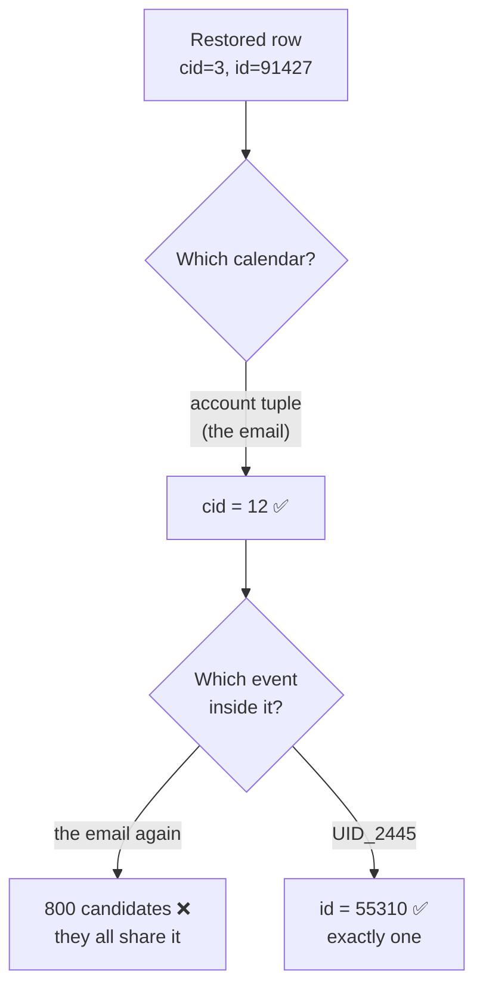
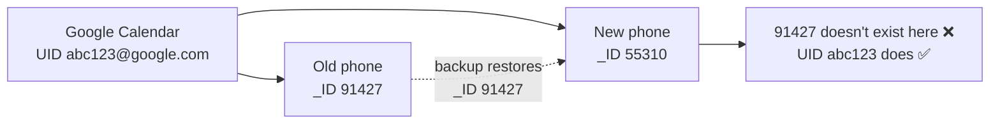
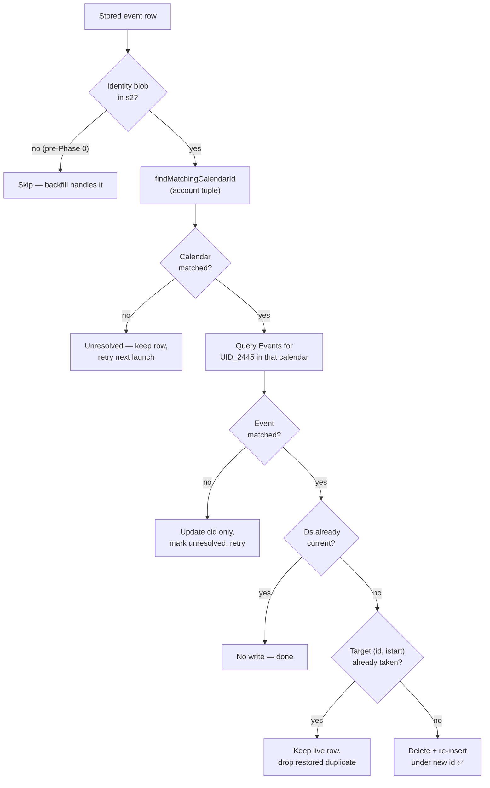

# Feature: Portable Event Identity (Restore-to-New-Device Calendar Re-association)

**GitHub Issue:** [#273](https://github.com/williscool/CalendarNotification/issues/273) — "Data Sync 2.0"

Scope: only the first half of #273, which the issue author split out explicitly:

> "One is is it possible to find out how to rearrange or store some new data so that you can restore a backup of the application (maybe just database) on a new phone and it will properly associate with the calendars. If we can do that let's do that."

The login/multi-device bidirectional sync half is deliberately **not** in this plan.

## Context

Android auto-backup already backs up every app database verbatim (`res/xml/backup_rules.xml` includes `domain="database" path="."`). So the event rows *do* arrive on a new phone. The problem is that what they store is **device-local numeric IDs that mean nothing on the new device**:

- `eventsV9.cid` — the calendar's `CalendarContract.Calendars._ID`
- `eventsV9.id` — the event's `CalendarContract.Events._ID`

Both are autoincrement row IDs assigned by the new device's Calendar Provider when it re-syncs from Google. They will not match. The result on a restored phone: snoozed/active events survive in the list but are orphaned — tapping one opens the wrong event or falls back to a time view, calendar filter pills don't match, and per-calendar "handled" settings silently revert to their `true` default.

The building blocks already exist but are wired into the wrong places:

| Building block | Where it lives | Currently used for |
|---|---|---|
| `CalendarBackupInfo` (account/type/owner/displayName/name) | `calendar/CalendarBackupInfo.kt` | settings JSON export only |
| `getCalendarBackupInfo()` / `findMatchingCalendarId()` (3-tier fallback match) | `calendar/CalendarProvider.kt:1765-1851` | settings import + single-event un-dismiss |
| `CalendarSettingBackup` durable tuple | `backup/BackupData.kt:29-37` | settings JSON export only |
| `CalendarRecord` (already carries owner/accountName/accountType/name) | `calendar/CalendarRecord.kt` | **never persisted** — only `calendarId` is |

Note `ApplicationController.restoreToActive()` (`app/ApplicationController.kt:1321-1325`) already *tries* to do the right thing, but it is structurally broken for the cross-device case:

```kotlin
val calendarBackupInfo = calendarProvider.getCalendarBackupInfo(context, event.calendarId)
```

It looks up the **old** calendar ID against the **new** device's provider — which returns `null` — then falls back to the stale ID. The identity must be captured at write time on the old device, not recovered at restore time on the new one.

## Goal

Store durable, provider-independent identity alongside every stored event so that a database restored onto a new phone can re-resolve itself to the correct local calendar and event rows. After this, restoring a backup (or just letting Android auto-backup do its thing) yields a working event list: correct calendar attribution, working filter pills, working "open in calendar", and correct per-calendar handled settings.

## Non-Goals

- **Login / accounts (Google, Zitadel)** — the other half of #273; tracked separately.
- **Bidirectional multi-device sync of snooze/mute state** — the second half of #273. This plan makes the *data* portable; it does not make it live-shared.
- **Changing the PowerSync/Supabase payload** — `cid` still ships raw to Supabase. Worth fixing later (it has no account context), but it's sync-side and out of scope here. See `docs/dev_todo/data_sync_improvements.md`.
- **A user-facing events export/import file** — this plan rides on the existing Android auto-backup of the DB files. A manual events export is a separate feature.
- **Schema migration** — explicitly avoided; see Key Decisions.
- **Re-resolving `MonitorStorage` alerts** — `MonitorAlertEntity.toAlertEntry()` already drops `calendarId` entirely and the monitor table is short-lived scan state, rebuilt from the provider. Not worth carrying identity there.

## Key Decisions Summary

| Decision | Choice | Rationale |
|---|---|---|
| Where to store identity | Existing **unused reserved columns** (`eventsV9.s2`, `dismissedEventsV2.s2`) as a small JSON blob | Zero schema migration, zero Room version bump, zero risk to the cr-sqlite/PowerSync column contract. These columns are written as `""` today and read by nothing. |
| Calendar identity | Reuse `CalendarBackupInfo` (account name/type, owner, displayName, name) | Already exists, already has a tested 3-tier fallback matcher, already the proven format in settings backup. |
| Event identity | `Events.UID_2445`, falling back to `Events._SYNC_ID` | `UID_2445` is the iCalendar UID — globally stable and identical across devices for the same Google/CalDAV event. Available since API 17; minSdk is 24. |
| When identity is captured | On every event write (add/update), best-effort | Cheap, keeps identity fresh, and means any future backup is restorable without a migration pass. |
| When re-resolution runs | Lazily, on a detected restore, **retrying** until resolved — plus a manual trigger | Calendars often sync onto the phone *after* our first launch, so a one-shot pass would match nothing. |
| Manual trigger UX | Mirror the existing pull-to-refresh + overflow "Refresh" in `prefs/CalendarsActivity.kt` | The user explicitly asked for "a way to manually invoke also like the refresh behavior in the handled calendars ui". That screen already does `ContentResolver.requestSync` then reloads — same shape. |
| Unmatched events | Leave the row intact with its stale ID, keep the identity blob, mark unresolved | Matches the existing fail-soft convention (`reloadCalendarEventAlertFromEvent` returns `NoChange` rather than deleting). Never destroy user data because a match failed. |
| Restore detection | Compare a stored install fingerprint against the current one | Cheap and reliable. Auto-backup deliberately excludes `events_storage_state.xml`, so a prefs-based marker is a proven pattern here. |

## Design Decisions

### Why reserved columns rather than a schema migration

`EventAlertEntity` (`eventsstorage/EventAlertEntity.kt`) declares `i2`–`i8` and `s2` as reserved, and `EventsStorageImplV9` writes them as `0`/`""`. Nothing reads them. Using `s2` means:

- No Room version bump, no new `Migration`, no new legacy `EventsStorageImplV10`.
- The Supabase table (`supabase/migrations/20250301213237_events.sql`) already has an `s2` column, so the sync payload keeps working unchanged.
- `installCrsqliteOnTable` in `src/lib/cr-sqlite/install.ts` rewrites the PK but doesn't enumerate columns — unaffected.

The tradeoff is that `s2` becomes semantically meaningful, so it needs a named constant and a comment at the entity declaration rather than staying "reserved". That's a documentation cost, not a correctness one.

### The two halves: why the email is necessary but not sufficient

There are **two** broken IDs, and the account email only fixes one of them.

| What's stale | Example | What identifies it durably |
|---|---|---|
| `cid` — *which calendar* | `3` | the account tuple (email + type + owner) |
| `id` — *which event in it* | `91427` | the event's iCalendar UID |

The email answers *"which calendar is this?"* — that's `findMatchingCalendarId()`, already written and already used by settings backup. It does **not** answer *"which of the 800 events in that calendar is this row?"* Every event in your work calendar shares the same email, so the email narrows 800 events down to 800 events.



So the plan uses **both**: the email tuple to find the calendar, then the UID to find the event within it.

### What `UID_2445` actually is

It's the [RFC 5545](https://datatracker.ietf.org/doc/html/rfc5545#section-3.8.4.7) iCalendar `UID` property — the identifier the calendar *format* uses, as opposed to `_ID`, which is just a row number in the local SQLite database. The `2445` is a fossil: RFC 2445 was the original iCalendar spec, obsoleted by 5545, but Android kept the constant name. It's `CalendarContract.Events.UID_2445`, present since API 17 (your minSdk is 24), and holds a string like:

```
040000008200E00074C5B7101A82E00800000000B0F2C8B5A1D9DA01000000000000000
```

or, on Google Calendar, typically something closer to `abc123def456@google.com`.

The key property: **the server assigns it, so it's the same string on every device that syncs that event.** `_ID` is assigned locally by whichever device happened to insert the row first, which is exactly why it doesn't survive a restore.



### Why not title + time instead

Title+time heuristics produce false positives on recurring and duplicated events (a weekly standup is many rows with identical titles), and break the moment the user edits a title. The UID survives renames, reschedules, and recurrence.

### Caveats

**Locally-created events that never synced to an account may have a null/empty `UID_2445`.** Those events are also the ones least likely to exist on the new phone at all — a local-only calendar isn't restored by Google. They degrade to unresolved and keep their stale ID: no crash, no data loss.

`_SYNC_ID` is the fallback when `UID_2445` is empty. It's also server-assigned and stable, but it's the sync adapter's own key rather than the portable iCalendar one, so it's second choice.

**The email tuple is not perfectly unique either** — this is why `findMatchingCalendarId()` already has three tiers. One account can expose several calendars (primary, birthdays, a shared team calendar), all with the same `ACCOUNT_NAME`. That's why the match uses account name + type + owner, and only falls back to display name.

### Resolution strategy

A restored event needs two lookups, in order:

1. **Calendar**: `findMatchingCalendarId(context, storedBackupInfo)` → new `cid`. Reuses the existing 3-tier matcher untouched.
2. **Event**: query `Events.CONTENT_URI` for `UID_2445 = ? AND CALENDAR_ID = ?` (scoped to the just-matched calendar to avoid cross-calendar collisions) → new `id`.

Because `(id, istart)` is the primary key of `eventsV9`, changing `id` is a **delete + re-insert**, not an update. That is the single riskiest operation in this plan, so it must be transactional per-event and must not run while the row is being mutated elsewhere. `instanceStartTime` is derived from the event's actual start time and is stable across devices for the same instance, so it carries over unchanged.

A PK collision is possible if the new `(id, istart)` already exists (e.g. the new device independently re-added the same event). In that case, keep the existing row and drop the restored duplicate — the live row is the more trustworthy one.

Every failure path below leaves the row intact and retryable — nothing is ever deleted because a match failed:



## Current Architecture

Identity flow today, and where it breaks on restore:

| Layer | Event identity | Calendar identity | Survives restore? |
|---|---|---|---|
| `eventsV9` / `dismissedEventsV2` | PK `(id, istart)` | payload `cid`, unindexed, `-1` = unknown | ❌ both stale |
| Per-calendar prefs | n/a | SharedPrefs key `calendar_handled_.<numericId>` | ❌ orphaned, defaults to `true` |
| Open in calendar app | `ContentUris.withAppendedId(Events.CONTENT_URI, eventId)` (`calendar/CalendarIntents.kt:37,45`) | not used | ❌ wrong/missing event |
| Reload/refresh | `getEvent(eventId)`, `getAlertByEventIdAndTime(eventId, alertTime)` (`app/CalendarReloadManager.kt`) | not used | ❌ degrades to `NoChange` |
| Settings JSON export | n/a | `CalendarSettingBackup` account tuple | ✅ already durable |

The key insight: the calendar half of this problem was already solved once for settings. This plan applies the same idea one layer down, to the event rows themselves, and adds the event half.

## Implementation Plan

### Phase 0: Capture identity at write time

**0a — Identity model.** New `calendar/PortableEventIdentity.kt`: a small serializable type holding the `CalendarBackupInfo` fields plus `eventUid` and the originating `calendarId`/`eventId`. Include a schema `version` field for forward compatibility. Serialize with kotlinx.serialization (already a dependency, used by `backup/BackupData.kt`) to a compact JSON string.

**0b — Read the UID from the provider.** Add `Events.UID_2445` (with `_SYNC_ID` fallback) to the projection in `CalendarProvider.getEvent()` (`calendar/CalendarProvider.kt:418-439`) and expose it on `EventRecord`. Keep it nullable — not every event has one.

**0c — Persist it.** Map the blob into `EventAlertEntity.s2` / `DismissedEventEntity.s2` in `fromRecord()`/`toRecord()`, and mirror it in `EventsStorageImplV9` and `DismissedEventsStorageImplV2` so the legacy fallback path doesn't silently drop it. Populate on add/update in `ApplicationController` where the record is first built from the provider.

**Checkpoint:** new events written on this device carry a populated `s2`. Existing rows still have `""` — that's expected and handled in Phase 2.

### Phase 1: Resolution engine

New `calendar/EventIdentityResolver.kt` — pure orchestration, no UI, constructor-injected `CalendarProviderInterface` and `CNPlusClockInterface` so it's Robolectric-testable (per `docs/testing/dependency_injection_patterns.md`).

Responsibilities:
- Given a stored record + its identity blob, resolve `(newCalendarId, newEventId)`.
- Report a typed outcome: resolved / unresolved-calendar / unresolved-event / no-identity-stored / already-current.
- Apply the resolution to storage, handling the delete+reinsert for a changed PK and the collision case from Design Decisions.

This class is the whole substance of the feature; keep it small and free of Android UI dependencies.

### Phase 2: Backfill for pre-existing rows

Rows written before Phase 0 have an empty `s2`. While the app is still on the *original* device, those rows can be backfilled by reading the identity from the live provider (the stale IDs are still valid here). Run this opportunistically on app start when unbackfilled rows exist.

This is what makes the feature useful to the current user rather than only to new installs — without it, today's data is still unrestorable.

### Phase 3: Restore detection + retry

Store an install fingerprint in its own SharedPreferences file, and **exclude that file from `backup_rules.xml`** so it does not survive a restore — the same trick `EventsStorageState` already relies on. Absent/mismatched fingerprint on launch ⇒ treat as a restore and mark all events pending re-resolution.

Retry semantics (per the user's answer): keep pending events marked until each resolves, re-attempting on app start and after calendar rescans, rather than burning the attempt once. Cap attempts with a backoff so a permanently-unmatchable event doesn't re-query forever.

### Phase 4: Manual trigger

Mirror `prefs/CalendarsActivity.kt:196-243`: a "Re-link events to calendars" action that requests a calendar sync, waits, then runs the resolver and reports counts (`resolved / unresolved`), reusing the `ImportStats`-style feedback shape from `backup/SettingsBackupManager.kt`. Placement next to the existing export/import entries in `prefs/MiscSettingsFragmentX.kt` is the natural home.

### Phase 5: Per-calendar settings repair

On a detected restore, rewrite orphaned `calendar_handled_.<oldId>` keys to their new IDs using the same matcher. `SettingsBackupManager.importCalendarSettings()` (`backup/SettingsBackupManager.kt:388-435`) already does exactly this from a JSON file — the logic should be extracted and shared rather than duplicated.

## Files to Modify/Create

### New Files

| File | Purpose |
|---|---|
| `calendar/PortableEventIdentity.kt` | Serializable identity blob + JSON encode/decode |
| `calendar/EventIdentityResolver.kt` | Resolution engine and typed outcomes |
| `test/.../calendar/EventIdentityResolverRobolectricTest.kt` | Core resolution logic tests |
| `test/.../calendar/PortableEventIdentityTest.kt` | Pure serialization round-trip tests |
| `androidTest/.../calendar/EventIdentityRestoreTest.kt` | Real-provider end-to-end |

### Modified Files

| File | Changes |
|---|---|
| `calendar/CalendarProvider.kt` | Add `UID_2445`/`_SYNC_ID` to `getEvent()` projection; add a lookup-by-UID query |
| `calendar/CalendarProviderInterface.kt` | Declare the new lookup |
| `calendar/EventRecord.kt` | Carry nullable `eventUid` |
| `eventsstorage/EventAlertEntity.kt` | Name `s2` as the identity column; map in `fromRecord`/`toRecord` |
| `eventsstorage/EventsStorageImplV9.kt` | Mirror the mapping on the legacy path |
| `dismissedeventsstorage/DismissedEventEntity.kt`, `DismissedEventsStorageImplV2.kt` | Same, for dismissed events |
| `app/ApplicationController.kt` | Populate identity on write; **fix `restoreToActive()` (line 1321) to use the stored blob instead of re-querying the stale ID** |
| `backup/SettingsBackupManager.kt` | Extract calendar-remap logic for reuse in Phase 5 |
| `prefs/MiscSettingsFragmentX.kt` | Manual re-link action |
| `res/xml/backup_rules.xml` | Exclude the new fingerprint prefs file |
| `res/values/strings.xml` | Strings for the action + result dialog |

## Testing Plan

Tests first, per `AGENTS.md`. `MockCalendarProvider` (`test/.../testutils/MockCalendarProvider.kt:204-224`) already stubs `getCalendarBackupInfo` and `findMatchingCalendarId`, so the Robolectric path is mostly already scaffolded; it needs a UID-lookup stub added.

### Unit / Robolectric

- **Serialization**: round-trip; unknown future `version` decodes without throwing; malformed/empty `s2` yields null rather than an exception (no broad `catch (Exception)` — catch `SerializationException` specifically).
- **Resolver happy path**: calendar and event both match → new IDs applied.
- **Partial match**: calendar matches, UID does not → calendar updated, event left stale, marked unresolved.
- **No match**: neither matches → row untouched, still marked pending (proves the retry path and the no-data-loss guarantee).
- **No identity stored**: legacy row with empty `s2` → skipped cleanly.
- **Already current**: IDs unchanged → no write (guards against pointless delete+reinsert churn).
- **PK collision**: target `(id, istart)` already occupied → existing row kept, duplicate dropped.
- **Backfill**: pre-existing row + live provider → `s2` populated.
- **Settings repair**: orphaned `calendar_handled_.N` keys remapped; unmatched ones reported.
- **Restore detection**: fingerprint absent/mismatched ⇒ restore; matching ⇒ no-op.

Follow the existing pattern in `test/.../calendar/CalendarBackupRestoreRobolectricTest.kt` (injected storage, no native SQLite).

### Instrumentation

Only for what needs the real Calendar Provider and real cr-sqlite:

- Create a calendar + event via the real provider, capture identity, simulate a restore by deleting and recreating the calendar/event under new IDs, and assert the resolver re-links correctly.
- Assert the delete+reinsert PK change survives a real `RoomEventsStorage` round-trip.
- Use the unique-suffix isolation technique from `docs/dev_completed/calendar_backup_restore_test_isolation.md` — that doc exists precisely because calendar IDs drift between runs.

Per `docs/build/wsl_unison_environment.md`, instrumentation runs from Windows (`C:\dev\CN`), filtered with `-Pandroid.testInstrumentationRunnerArguments.class=...`, **not** `--tests`.

## Verification

1. **Unit/Robolectric** (from WSL):
   `cd android && ./gradlew -PBUILD_ARCH="x86_64" -PreactNativeArchitectures="x86_64" :app:testX8664DebugUnitTest`
2. **Instrumentation** (from Windows, after the user runs Unison — *never* run it unprompted):
   `.\gradlew.bat :app:connectedX8664DebugAndroidTest -Pandroid.testInstrumentationRunnerArguments.class=com.github.quarck.calnotify.calendar.EventIdentityRestoreTest`
3. **Real end-to-end restore** using the existing harness `scripts/test_cloud_backup.sh com.github.quarck.calnotify` — it drives `bmgr` through a real backup/uninstall/reinstall cycle. Before: restored events are orphaned. After: they re-link. This is the actual acceptance test for the issue.
4. **Manual sanity**: with events snoozed, trigger the manual re-link action and confirm the reported resolved/unresolved counts, filter pills, and "open in calendar" all behave.

## Open Questions

- Should a restored-but-unresolved event be visually marked in the list (e.g. the existing `calendarId = -1` "calendar not found" treatment via `createCalendarNotFoundCal`), or stay silent until it resolves? Leaning silent, since the retry usually resolves it within a sync cycle or two.
- `DismissedEventsStorage` carries the identity blob for symmetry, but dismissed events are historical. Worth confirming whether re-resolving them is wanted at all, or whether Phase 0's capture is enough there.
