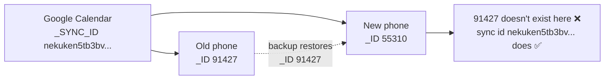
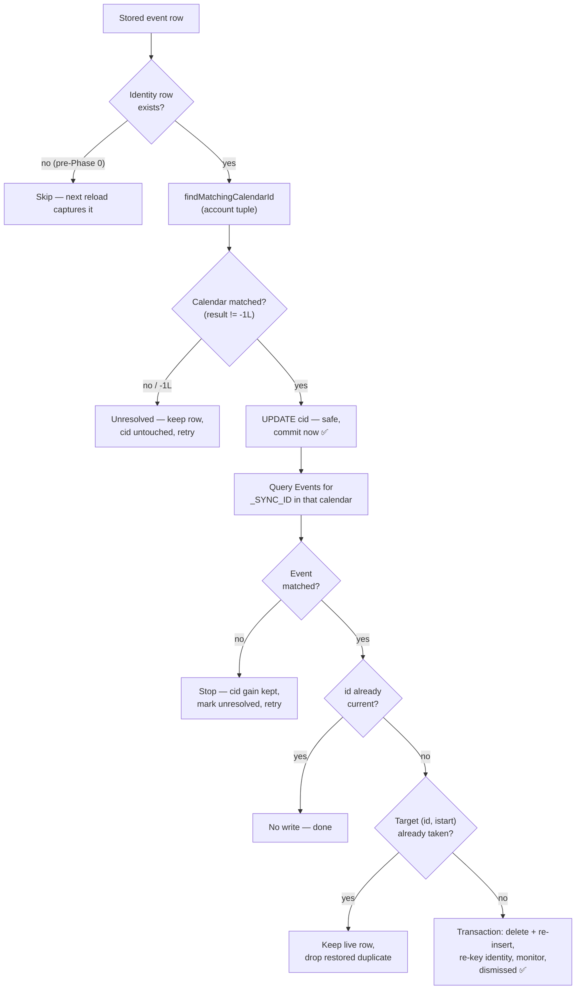

# Feature: Portable Event Identity (Restore-to-New-Device Calendar Re-association)

**GitHub Issue:** [#273](https://github.com/williscool/CalendarNotification/issues/273) — "Data Sync 2.0"

Scope: only the first half of #273, which the issue author split out explicitly:

> "One is is it possible to find out how to rearrange or store some new data so that you can restore a backup of the application (maybe just database) on a new phone and it will properly associate with the calendars. If we can do that let's do that."

The login/multi-device bidirectional sync half is deliberately **not** in this plan.

## Context

Android auto-backup already backs up every app database verbatim (`res/xml/backup_rules.xml` includes `domain="database" path="."`). So the event rows *do* arrive on a new phone. The problem is that what they store is **device-local numeric IDs that mean nothing on the new device**:

- `eventsV9.cid` — the calendar's `CalendarContract.Calendars._ID`
- `eventsV9.id` — the event's `CalendarContract.Events._ID`

Both are autoincrement row IDs assigned by the new device's Calendar Provider when it re-syncs from Google. They will not match. The result on a restored phone: snoozed/active events survive in the list but are orphaned — tapping one opens the wrong event or falls back to a time view, calendar filter pills don't match, and per-calendar "handled" settings silently revert to their `true` default.

The building blocks already exist but are wired into the wrong places:

| Building block | Where it lives | Currently used for |
|---|---|---|
| `CalendarBackupInfo` (account/type/owner/displayName/name) | `calendar/CalendarBackupInfo.kt` | settings JSON export only |
| `getCalendarBackupInfo()` / `findMatchingCalendarId()` (3-tier fallback match) | `calendar/CalendarProvider.kt:1765-1851` | settings import + single-event un-dismiss |
| `CalendarSettingBackup` durable tuple | `backup/BackupData.kt:29-37` | settings JSON export only |
| `CalendarRecord` (already carries owner/accountName/accountType/name) | `calendar/CalendarRecord.kt` | **never persisted** — only `calendarId` is |

Note `ApplicationController.restoreToActive()` (`app/ApplicationController.kt:1321-1325`) already *tries* to do the right thing, but it is structurally broken for the cross-device case:

```kotlin
val calendarBackupInfo = calendarProvider.getCalendarBackupInfo(context, event.calendarId)
```

It looks up the **old** calendar ID against the **new** device's provider — which returns `null` — then falls back to the stale ID. The identity must be captured at write time on the old device, not recovered at restore time on the new one.

## Goal

Store durable, provider-independent identity alongside every stored event so that a database restored onto a new phone can re-resolve itself to the correct local calendar and event rows. After this, restoring a backup (or just letting Android auto-backup do its thing) yields a working event list: correct calendar attribution, working filter pills, working "open in calendar", and correct per-calendar handled settings.

### The precondition: identity must be captured *before* the move

This is the single most important thing to understand about the design, and it is easy to misread.

The event UID (in practice `_SYNC_ID` — see the probe results below) is **not** something that can be looked up from an orphaned row. The app has no way to ask the new device "what is the sync id of event `91427`?", because `91427` is a row number that means nothing there. It has to be read from the provider on the **old** device, while the IDs are still valid, and stored.

So the mechanism is a snapshot, not a lookup:

```
OLD DEVICE                              NEW DEVICE
  event id=91427  ──read UID from──►  provider
        │              provider
        ▼
  identity row                        (restore)
  uid=abc123@google.com  ────────────────────►  search provider for
                                                 uid=abc123@google.com
                                                        │
                                                        ▼
                                                 found: id=55310 ✅
```

**The practical consequence** depends on where the backup is restored, and it is worth being precise because there are three cases, not two:

| Case | Identity rows present? | Can they be created? |
|---|---|---|
| Backup taken **after** this ships | Yes — captured at write time | n/a, already there |
| Older backup, restored onto the **same** device (or one whose provider still holds those IDs) | No | **Yes** — the next calendar reload captures them from the live provider, because the stored IDs are still valid there |
| Older backup, restored onto a **new** device | No | **No** — the IDs resolve to nothing or to unrelated events, so Phase 6's content heuristic is the only option |

The middle row is the one worth noticing: **an old backup is not automatically a lost cause.** Restore it onto the original device, let a calendar reload run, and the data becomes identity-bearing — and therefore portable from then on. That is a genuine migration path for data captured before this feature existed: restore old → reload → re-backup → move.

The case that truly cannot be fixed is the last one: identity was never captured, and the provider that could have supplied it is gone. That is exactly what Phase 6 exists for, and why it is best-effort rather than exact.

### Two tiers, deliberately

| | Requires | Accuracy | Covers |
|---|---|---|---|
| **Exact** (Phases 0–5) | A backup taken after this ships | Exact — UID match, no guessing | The intended path |
| **Best-effort** (Phase 6) | Nothing; works on any orphaned row | Heuristic — may decline | Older backups, already-restored devices |

Phase 6 exists precisely because the precondition above will not always hold — including for data already sitting orphaned today. It matches on content that survives a restore (title + instance start time) rather than on identity, so it is partial by nature and declines rather than guesses. It is a safety net under the main mechanism, not a substitute for it.

## Non-Goals

- **Login / accounts (Google, Zitadel)** — the other half of #273; tracked separately.
- **Bidirectional multi-device sync of snooze/mute state** — the second half of #273. This plan makes the *data* portable; it does not make it live-shared.
- **Changing the PowerSync/Supabase payload** — `cid` still ships raw to Supabase. Worth fixing later (it has no account context), but it's sync-side and out of scope here. See `docs/dev_todo/data_sync_improvements.md`.
- **A user-facing events export/import file** — this plan rides on the existing Android auto-backup of the DB files. A manual events export is a separate feature.
- **Guaranteed recovery when identity was never captured** — Phase 6 is a best-effort heuristic for older backups and already-restored devices. It is explicitly partial: recurring events are skipped by design, and renamed or duplicate-titled events will not match. Not a guarantee, and gated behind a manual action.
- **Migrating the existing databases** — no schema change to `eventsV9`, `dismissedEventsV2`, or `manualAlertsV1`. The identity database is new and starts at version 1.
- **Storing identity for `MonitorStorage` rows** — no identity row of its own, but its rows still need re-keying when an `id` changes. `MonitorAlertEntity.toAlertEntry()` drops `calendarId` entirely and the table is short-lived scan state rebuilt from the provider, so there is nothing to capture; the re-key is covered in the cross-database note in Design Decisions.

## Key Decisions Summary

| Decision | Choice | Rationale |
|---|---|---|
| Where to store identity | A **new, dedicated Room database** with typed columns | Keeps the scarce reserved text columns free for data that must live in the event row. Identity is off the hot path, joinable by key, and stays out of the Supabase sync payload by construction. |
| Calendar identity | Reuse `CalendarBackupInfo` (account name/type, owner, displayName, name) | Already exists, already has a tested 3-tier fallback matcher, already the proven format in settings backup. |
| Event identity | **`Events._SYNC_ID`**, with `Events.UID_2445` read opportunistically | **Measured, not assumed:** on a real device `UID_2445` was null for all 4761 events while `_SYNC_ID` was populated and unique for 100% of them. See the probe results below. |
| When identity is captured | On every event write (add/update), best-effort | Cheap, keeps identity fresh, and means any future backup is restorable without a migration pass. |
| When re-resolution runs | Lazily, on a detected restore, **retrying** until resolved — plus a manual trigger | Calendars often sync onto the phone *after* our first launch, so a one-shot pass would match nothing. |
| Manual trigger UX | Mirror the existing pull-to-refresh + overflow "Refresh" in `prefs/CalendarsActivity.kt` | That screen already requests a calendar sync then reloads, which is exactly the shape needed here. Reusing a familiar interaction beats inventing a new one. |
| Unmatched events | Leave the event row intact with its stale ID, keep the identity row, mark unresolved | Matches the existing fail-soft convention (`reloadCalendarEventAlertFromEvent` returns `NoChange` rather than deleting). Never destroy user data because a match failed. |
| Storage scope | **Room implementations only** | Legacy storage is deprecated and scheduled for removal (`deprecated_features.md` item 5). It's a migration-failure fallback; new code there would be written to be deleted. |
| Restore detection | Compare a stored install fingerprint against the current one | Cheap and reliable. Auto-backup deliberately excludes `events_storage_state.xml`, so a prefs-based marker is a proven pattern here. |

## Design Decisions

### Why a separate Room database rather than a reserved column

An earlier revision of this plan stored the identity blob in the unused `eventsV9.s2` reserved column. That is rejected in favour of a **new, dedicated Room database**.

The reserved columns (`i2`–`i8`, `s2`) are a small, finite, one-time resource — there is exactly one spare text column per table, and claiming it is effectively irreversible once rows are written. It should be spent on data that **must** live inside the event row: something read on the app's hot path, needed in the same query as the event, or required to travel with the row through the PowerSync/Supabase pipeline.

Portable identity is none of those:

- **It is not read on the hot path.** Nothing in normal app runtime touches it. Only `EventIdentityResolver` reads it, and only on a detected restore or a manual re-link.
- **It does not need to be in the same row.** It is keyed by `(eventId, instanceStartTime)` and can be joined when needed.
- **It should not travel to Supabase.** The sync layer targets the `eventsV9` table by name, so keeping identity out of that table keeps it out of the sync payload by construction — which is what we want, since the blob contains account emails.

That last point inverts an argument from the earlier revision. Using `s2` was originally justified partly because the Supabase table already mirrors it, so the payload "keeps working unchanged" — but on reflection, silently shipping account identifiers to the remote database is a drawback, not a benefit.

#### What the separate database costs

Less than it might appear, because the infrastructure is already in place:

- **No schema migration.** A brand-new database starts at `version = 1` with no legacy predecessor and no copy-migration step — strictly simpler than the existing three, which all carry legacy baggage. `monitorstorage/MonitorDatabase.kt` is the closest template: single entity, `version = 1`, `exportSchema = false`.
- **Backed up by default today, but this needs care.** Any new database file is currently covered — though on Android 12+ that is because the platform backs up everything when `dataExtractionRules` is absent, *not* because `backup_rules.xml`'s `<include domain="database" path="." />` is read (it isn't; see Phase 3). Once Phase 3 adds a `data-extraction-rules` file, that include must be repeated in **both** the `<cloud-backup>` and `<device-transfer>` sections, or the identity DB silently stops being backed up on one path. This is essential — the identity DB is useless unless it restores alongside the events it describes.
- **No sync impact.** PowerSync/cr-sqlite is wired to `eventsV9` explicitly (`src/lib/features/SetupSync.tsx`, `src/lib/powersync/Schema.tsx`); a new table is invisible to it.

The real cost is the one inherent to this codebase: **a fourth separate database file means a fourth store with no cross-database transactions.** Identity rows can drift from the events they describe — e.g. an event is deleted but its identity row lingers. This is tolerable because identity rows are pure derived metadata: an orphaned one is harmless, and the resolver ignores identity with no matching event. A periodic cleanup pass can prune orphans opportunistically; correctness never depends on it.

#### Schema

One table, keyed to match `eventsV9`'s primary key so rows join cleanly. One column per row — no slash-combined entries, no abbreviations.

| Column | Type | Notes |
|---|---|---|
| `eventId` | Long | PK part 1. Joins to `eventsV9.id` |
| `instanceStartTime` | Long | PK part 2. Joins to `eventsV9.istart` |
| `calendarAccountName` | String | `Calendars.ACCOUNT_NAME` — usually the account email |
| `calendarAccountType` | String | `Calendars.ACCOUNT_TYPE` — e.g. `com.google` |
| `calendarOwnerAccount` | String | `Calendars.OWNER_ACCOUNT` |
| `calendarDisplayName` | String | `Calendars.CALENDAR_DISPLAY_NAME` — e.g. "Work" |
| `calendarName` | String | `Calendars.NAME` |
| `eventSyncId` | String? | `Events._SYNC_ID` — the primary identifier, populated for 100% of events measured |
| `eventUid` | String? | `Events.UID_2445` — opportunistic; null on Google, may be populated by other providers |
| `originalCalendarId` | Long | The `cid` in force when this row was captured |
| `originalEventId` | Long | The `id` in force when this row was captured |
| `capturedAtTime` | Long | Via `CNPlusClockInterface`, never `System.currentTimeMillis()` |
| `resolutionAttemptCount` | Int | Backs the Phase 3 retry cap |
| `lastResolutionAttemptTime` | Long | Backs the retry backoff |

**Spell the names out.** The `eventsV9` abbreviations (`cid`, `istart`, `dsts`, `attsts`) are a 2016 inheritance that is now costly to change and easy to misread — `attsts` vs `oattsts` being the worst case. This table is new, so it carries no such constraint: the five calendar columns map one-to-one onto the `CalendarContract.Calendars` columns they come from and are named to make that obvious. The storage cost of long column names is per-schema, not per-row.

**Real typed columns, not a JSON blob.** Once the constraint of squeezing into one text column is gone, there is no reason to serialize. Typed columns are queryable (e.g. "rows where `resolutionAttemptCount` exceeds the cap"), enforced by Room at compile time, and need no `SerializationException` handling. `resolutionAttemptCount` in particular becomes a plain `UPDATE` rather than a decode/mutate/re-encode cycle.

It also means no serialization layer at all: the Room entity *is* the model, with no encode/decode step to test or to fail.

### The two halves: why the email is necessary but not sufficient

There are **two** broken IDs, and the account email only fixes one of them.

| What's stale | Example | What identifies it durably |
|---|---|---|
| `cid` — *which calendar* | `3` | the account tuple (email + type + owner) |
| `id` — *which event in it* | `91427` | the event's iCalendar UID |

The email answers *"which calendar is this?"* — that's `findMatchingCalendarId()`, already written and already used by settings backup. It does **not** answer *"which of the 800 events in that calendar is this row?"* Every event in your work calendar shares the same email, so the email narrows 800 events down to 800 events.


So the plan uses **both**: the email tuple to find the calendar, then the UID to find the event within it.

### What these identifiers actually are

Two columns carry a server-assigned identifier, and the distinction turned out to matter — see the measured result below.

**`UID_2445`** is the [RFC 5545](https://datatracker.ietf.org/doc/html/rfc5545#section-3.8.4.7) iCalendar `UID` property — the identifier the calendar *format* uses, as opposed to `_ID`, which is just a row number in the local SQLite database. The `2445` is a fossil: RFC 2445 was the original iCalendar spec, obsoleted by 5545, but Android kept the constant name. It is the *correct* identifier in principle, and **empty in practice on Google calendars.**

**`_SYNC_ID`** is the sync adapter's own key for the event. On Google it holds values like `nekuken5tb3bvpoj8ncg4er7f0` or `20261031_jg75kt4ps505q4u01pbpictp2o` — Google's event-id encoding. Less standard than the iCalendar UID, but it is the one that is actually populated.

The key property, which both share: **the server assigns it, so it is the same string on every device that syncs that event.** `_ID` is assigned locally by whichever device happened to insert the row first, which is exactly why it does not survive a restore.

To be explicit, since this is the easy misreading: the identifier is useful only because we **stored it on the old device**. It is a value we carry with us, not one the new device can derive from an orphaned row — see the precondition in the Goal.



### Why not title + time instead

Title+time heuristics produce false positives on recurring and duplicated events (a weekly standup is many rows with identical titles), and break the moment the user edits a title. A server-assigned id survives renames, reschedules, and recurrence.

### Caveats

**Locally-created events that never synced to an account have neither identifier.** AOSP's `CalendarProvider2` notes that *"if this event hasn't been sync'ed with the server yet, the `_sync_id` field will be null"*, and `UID_2445` is empty on Google regardless. Such events are also the least likely to exist on the new phone at all — a local-only calendar is not restored by Google. They degrade to unresolved and keep their stale ID: no crash, no data loss.

#### RESULT: `UID_2445` is empty; `_SYNC_ID` is the real identifier

**Measured 2026-09-20, Pixel 10 Pro Fold (API 37), 16 Google calendars across two accounts:**

```
accountType                  total     uid    pct   syncId   neither
com.google                    4761       0     0%     4761         0
----------------------------------------------------------------------
OVERALL                       4761       0     0%     4761         0
```

The long-standing Android issue is real and current: **`UID_2445` is null for every single event.** The column exists and is queryable, but Google's sync adapter never populates it.

`_SYNC_ID` is the opposite — populated for 100% of events, and **4761 unique values across 4761 events**, i.e. perfectly unique with no collisions. Values look like `nekuken5tb3bvpoj8ncg4er7f0` and `20261031_jg75kt4ps505q4u01pbpictp2o`, which is Google's own event-id encoding.

**Consequences for this plan:**

1. **`_SYNC_ID` becomes the primary event identifier, not the fallback.** Read `UID_2445` opportunistically — it costs one column and may be populated by non-Google providers (CalDAV, Exchange) — but nothing should depend on it.
2. **The exact-match path survives intact.** This was the real risk the probe existed to check, and it came back fine: there *is* a stable, server-assigned, unique per-event identifier. Only its name changes.
3. **Phase 6 stays optional.** It is still the fallback for missing identity, not the primary mechanism.

**Recurring events behave well**, which matters for the Phase 1b re-key:

- A recurring series has **one** `_SYNC_ID` for the parent event, not one per instance — so `(sync_id, instanceStartTime)` identifies a specific occurrence.
- Recurrence **exceptions** (1021 of them here) carry `original_sync_id` pointing at the parent series, so a modified single occurrence stays traceable.

**Caveat carried forward:** this is one device with one provider type (`com.google`). The never-synced local-event case still degrades to unresolved, exactly as the Caveats section describes — this device simply has no local-only calendars to demonstrate it. Re-run the probe on a device with Exchange or CalDAV accounts before assuming the same holds there.

**Validated against the live app database on the same device** (368 stored events, Room active):

| Check | Result |
|---|---|
| Stored `cid` values | 2 calendars (6, 16), both still present |
| Stored `id` resolves in provider | 362 / 368 |
| **Phase 2 backfill would capture `_SYNC_ID`** | **368 / 368 (100%)** |
| Reserved `s2` column empty | 368 / 368 — the plan's premise holds |

The 6 whose *instance* had vanished are snoozed occurrences of deleted recurring series; their parent event rows still exist, so backfill still reaches a `_SYNC_ID` for them. That is why backfill scores 100% while direct instance resolution scores 362.

**The calendar matcher was also validated.** All 16 calendars on this device produce a **unique** tier-1 key (`account_name` + `account_type` + `ownerAccount`) — zero ambiguity, despite only two distinct account names across them. `ownerAccount` is what disambiguates, which confirms `findMatchingCalendarId`'s existing three-tier design is right for this setup rather than merely plausible.

`./scripts/capture_calendar_snapshot.sh` saves all of this to `./tmp/` (gitignored — it is real calendar data) so the analysis can be re-run without a device. Verified equivalent: replaying the backfill simulation from a snapshot reproduces the same 368/368.

Reproduce with `./scripts/probe_uid2445.sh`. The app-database checks used `adb exec-out run-as com.github.quarck.calnotify cat databases/RoomEvents` — note `exec-out`, not `shell`, or the binary is corrupted in transit, and pull the `-wal` file too or the DB reads as malformed.

#### How that was measured

The exact-match path assumes a stable per-event identifier exists. A long-standing Android issue titled ["CalendarContract.Events.UID_2445 column is always null"](https://issuetracker.google.com/issues/37053160) put that in doubt, so it was tested rather than trusted — and the issue turned out to be accurate.

Implemented as `androidTest/.../calendar/Uid2445PopulationProbeTest.kt`. It is a **diagnostic, not an assertion**: it reports and never fails on low coverage, since "this device has no synced calendars" is a property of the device rather than a bug. It also tallies `_SYNC_ID` alongside `UID_2445` so the fallback's real value gets measured rather than assumed, and counts events carrying *neither* — those are the ones the exact path can never recover.

```
.\gradlew.bat :app:connectedX8664DebugAndroidTest -Pandroid.testInstrumentationRunnerArguments.class=com.github.quarck.calnotify.calendar.Uid2445PopulationProbeTest
adb logcat -s Uid2445Probe:* | grep UID2445_PROBE
```

Run it against a device with **real, Google-synced calendars** — a clean emulator has no synced events and will report `INCONCLUSIVE`, which is not evidence either way.

There is also a no-build version, `scripts/probe_uid2445.sh`, which reads the provider over `adb shell content query` and prints the same table and verdict. Prefer it for a quick answer; it needs no compile, install, or instrumentation run.

Its tallying logic lives in `scripts/lib/uid2445_tally.awk` and is covered by `scripts/lib/test_uid2445_tally.sh`, which runs against captured provider output in `scripts/lib/testdata/` — so the parsing can be verified without a device.

#### Can this run against a backup instead of a live device?

**No, and the reason is worth recording because it constrains more than this probe.**

`UID_2445` lives in the **Calendar Provider's** database (`com.android.providers.calendar`) — a different app. This app's backup covers only its own data: per `res/xml/backup_rules.xml`, the `eventsV9` databases and two prefs files. It contains no calendar-provider rows at all, so there is nothing in a CNPlus backup to measure.

Reading the provider's own database directly is also not available: `adb shell run-as` only works on your own debuggable package, so `com.android.providers.calendar` is out of reach without root.

The wider consequence for this plan: **the provider is only ever readable live.** That is exactly why identity must be captured at write time (Phases 0/2) rather than reconstructed later, and why an already-restored device has nothing but row content to match on (Phase 6).

Re-run it on any device with a non-Google provider (Exchange, CalDAV) before assuming these numbers generalize — the measurement so far covers `com.google` only.

**The email tuple is not perfectly unique either** — this is why `findMatchingCalendarId()` already has three tiers. One account can expose several calendars (primary, birthdays, a shared team calendar), all with the same `ACCOUNT_NAME`. That's why the match uses account name + type + owner, and only falls back to display name.

### What gets stored, and who uses it

One identity row per stored event, holding **everything needed to find that event again from scratch** using only identifiers that are meaningful on a different device. For an event in a Google work calendar:

| Column | Example value |
|---|---|
| `eventId` | `91427` |
| `instanceStartTime` | `1764547200000` |
| `calendarAccountName` | `will@example.com` |
| `calendarAccountType` | `com.google` |
| `calendarOwnerAccount` | `will@example.com` |
| `calendarDisplayName` | `Work` |
| `calendarName` | `will@example.com` |
| `eventUid` | `abc123def456@google.com` |
| `originalCalendarId` | `3` |
| `originalEventId` | `91427` |

`eventId` + `instanceStartTime` are the join key back to `eventsV9`.

**Why store `originalCalendarId`/`originalEventId` when they duplicate the event row?** They are the staleness check. If `originalEventId` still equals the event's current `id`, resolution has not run for this row; if they differ, it already has. Without them there is no way to distinguish "never resolved" from "already resolved" — which matters because the retry loop re-runs on every launch and must not redo completed work.

**Who writes it:** Phase 0c, during every calendar reload. Because installing this version triggers a reload, that single mechanism covers both fresh and pre-existing events.

**Who reads it:** only `EventIdentityResolver`. Nothing in normal app runtime reads this database. The app keeps using `cid`/`id` exactly as it does today; these rows lie dormant until a restore is detected or the manual re-link action runs, at which point they are the sole input to the resolution below.

**What it is not:** not a cache of event content. Title, times, and location live in their own columns in `eventsV9` and are refreshed from the provider by the normal reload path. Duplicating them here would create a second source of truth that could drift.

### Resolution strategy

Resolution consumes the identity rows described above. A restored event needs two lookups, in order:

1. **Calendar**: `findMatchingCalendarId(context, storedBackupInfo)` → new `cid`. Reuses the existing 3-tier matcher untouched.
2. **Event**: query `Events.CONTENT_URI` for `_sync_id = ? AND CALENDAR_ID = ?` (scoped to the just-matched calendar to avoid cross-calendar collisions) → new `id`. Fall back to `UID_2445` where the stored row has one.

#### The `-1L` sentinel must be guarded explicitly

`findMatchingCalendarId()` signals "no match" by returning **`-1L`, not `null`** (`CalendarProvider.kt:1851`), after all three fallback tiers miss.

That is not a neutral "unknown" in this schema. As the schema reference records, `cid = -1` means *unknown, treated as handled* — it is fail-open. So writing an unguarded matcher result would convert a stale-but-plausible calendar ID into `-1`, which the app then reads as handled. The row would get quieter rather than better, inverting the premise that rewriting a broken row can only move it toward working.

**Every use of the matcher's result must check `!= -1L` before writing it.** A no-match is the unresolved path: leave `cid` untouched and retry later.

The same trap already exists in shipping code. `restoreToActive()` (`ApplicationController.kt:1324-1326`) uses an elvis operator that catches a `null` from `getCalendarBackupInfo()` but passes a `-1L` from the matcher straight through into the event copy:

```kotlin
val newCalendarId = calendarBackupInfo?.let { backupInfo ->
    calendarProvider.findMatchingCalendarId(context, backupInfo)
} ?: event.calendarId // catches null, but not -1L
```

Since "Files to Modify" already commits to fixing that line, the guard belongs in both places.

#### Which write is actually dangerous

Worth separating, because the two updates carry very different risk:

- **`cid` is a plain column.** Changing it is an ordinary in-place `UPDATE` — not destructive, not a PK change. Nothing is deleted.
- **`id` is half the primary key.** Room's `@Update` matches *on* the PK, so it structurally cannot change it. Changing `id` means **delete + re-insert**, and that's the one genuinely dangerous operation here.

So the sequencing rule is: **update `cid` first and commit it.** Even if the event lookup then fails, the row has strictly improved — the calendar is now correct, filter pills work, and per-calendar settings apply. Nothing is risked to gain that.

#### Why we can afford to be bold about it

A restored row is already broken, and that is what makes rewriting it tractable. A row whose `id` points at a nonexistent event is inert: it cannot be opened, it cannot be reloaded, and `reloadCalendarEventAlertFromEvent` degrades it to `NoChange` indefinitely. **Rewriting it can only move it from broken toward working.**

But "already broken" is only true when the ID is genuinely stale. It is *not* true if we're wrong about that — and a false positive would delete a live, working row. So the delete+re-insert is gated on having positively identified the replacement first:

1. Resolve the new `id` **before touching storage**. No match → no write at all; the row stays exactly as it is.
2. Only if a new `id` is found, and it differs from the current one, perform delete+insert **inside a single transaction** (`RoomEventsStorage` already uses `runInTransaction`/`beginTransaction` throughout).
3. Never delete without a successful insert in the same transaction. A crash mid-way rolls back to the original row.

`instanceStartTime` carries over unchanged — it's derived from the event's actual start time and is stable across devices for the same instance.

#### The collision case

If the new `(id, istart)` already exists, the new device independently re-added the same event. Keep the existing row and drop the restored duplicate: the live row is the one the app has actually been maintaining. This is a genuine merge decision, not an error.

#### Cross-database fallout

`MonitorStorage` lives in a **separate database** and is keyed `(eventId, alertTime, instanceStart)`. Changing `id` in `eventsV9` therefore orphans the matching monitor alert, and there are no cross-database transactions to lean on.

This matters concretely: `restoreToUpcoming` (`ApplicationController.kt:1293-1300`) aborts when `clearWasHandled` can't find the alert, specifically to prevent data loss. An orphaned monitor row would make un-dismissing such an event fail.

The same applies to `dismissedEventsV2`, which is keyed on `eventId` in its own database.

The identity database itself is keyed the same way, so it is a fourth store needing the same treatment — its row must move to the new `(eventId, instanceStartTime)` alongside the event, or the next retry would not find it.

So the resolver must re-key **four** databases for a given event, in a defined order, with manual rollback on partial failure — the pattern `unsnoozeToUpcoming` already establishes. This is why the `id` re-key is split into its own sub-phase: `eventsV9` plus its identity row land first, with the monitor and dismissed databases as follow-on steps carrying their own tests.

Every failure path below leaves the row intact and retryable — nothing is ever deleted because a match failed:



### How far back does the new device's calendar actually go?

A real constraint on how much this feature can ever recover, and worth stating plainly because it bounds expectations.

**Google Calendar syncs roughly the past 12 months and the next 12 months** to the device's Calendar Provider. Older events exist on the server but are simply not present locally — they're reachable only via calendar.google.com. ([Google Calendar Help](https://support.google.com/calendar/answer/6261951?hl=en&co=GENIE.Platform%3DAndroid), [aCalendar's writeup](https://acalendar.tapirapps.de/en/support/solutions/articles/36000013393-past-future-events-are-missing-in-google-calendars))

**Can we widen that window?** No. `ContentResolver.requestSync()` takes extras like `SYNC_EXTRAS_MANUAL` / `SYNC_EXTRAS_EXPEDITED` — which is exactly what `CalendarsActivity.requestCalendarSyncAndRefresh()` already does — but there is **no API to request a date range**. The window is the sync adapter's own policy; a third-party app cannot parameterize or extend it. There's no service to call to backfill older events into the provider.

**How much does this actually cost us?** Very little in practice, because of what this app stores:

- `MAX_SCAN_BACKWARD_DAYS = 31` (`Consts.kt:177`) — the app itself only looks back a month.
- Active and snoozed events are, by their nature, recent or upcoming. An event snoozed from 14 months ago is not a realistic case.
- Dismissed-event history is the only store that reaches far back, and it's historical: it doesn't need to reopen in the calendar app.

So the 12-month floor sits well outside the range this feature actually operates in. The honest framing is that **this is a limit on the tail, not on the feature.**

Note this bounds Phase 6 as well: heuristic matching queries the same provider, so an event outside the sync window has no candidates to match against regardless of how good the heuristic is.

**What happens to an event outside the window:** exactly the unresolved path already specified — the row is kept, marked unresolved, and retried. It never resolves, which is correct: the event genuinely isn't on this device. The app already renders this gracefully via `createCalendarNotFoundCal` (`CalendarProvider.kt:1384`). No crash, no data loss, no special-casing needed.

This does mean the retry cap from Phase 3 matters — without a backoff, permanently-unmatchable old events would re-query the provider forever.

## Current Architecture

Identity flow today, and where it breaks on restore:

| Layer | Event identity | Calendar identity | Survives restore? |
|---|---|---|---|
| `eventsV9` / `dismissedEventsV2` | PK `(id, istart)` | payload `cid`, unindexed, `-1` = unknown | ❌ both stale |
| Per-calendar prefs | n/a | SharedPrefs key `calendar_handled_.<numericId>` | ❌ orphaned, defaults to `true` |
| Open in calendar app | `ContentUris.withAppendedId(Events.CONTENT_URI, eventId)` (`calendar/CalendarIntents.kt:37,45`) | not used | ❌ wrong/missing event |
| Reload/refresh | `getEvent(eventId)`, `getAlertByEventIdAndTime(eventId, alertTime)` (`app/CalendarReloadManager.kt`) | not used | ❌ degrades to `NoChange` |
| Settings JSON export | n/a | `CalendarSettingBackup` account tuple | ✅ already durable |

The key insight: the calendar half of this problem was already solved once for settings. This plan applies the same idea one layer down, to the event rows themselves, and adds the event half.

## Implementation Plan

### Phase 0: Capture identity at write time

**Prerequisite met.** The probe has run (see Design Decisions): `UID_2445` is null on Google calendars, but `_SYNC_ID` is populated and unique for 100% of events, so the exact-match path stands with `_SYNC_ID` as the identifier.

**0a — Identity storage.** New `identitystorage/` package following the shape of `monitorstorage/`: `EventIdentityEntity` (the schema in Design Decisions), `EventIdentityDao`, and `EventIdentityDatabase` at `version = 1`, name `RoomEventIdentity`. No legacy predecessor and no copy-migration — this is a fresh database. Use `CrSqliteRoomFactory` for consistency with the existing three.

**0b — Read the identifiers from the provider.** Add `Events._SYNC_ID` (primary) and `Events.UID_2445` (opportunistic) to the projection in `CalendarProvider.getEvent()` (`calendar/CalendarProvider.kt:418-439`) and expose both on `EventRecord`. Keep both nullable — never-synced events have neither.

**0c — Persist it, during the calendar reload.** Write identity rows from `CalendarReloadManager.reloadCalendarInternal`, keyed `(eventId, instanceStartTime)`.

**Not from `registerNewEvent`.** That is the `EVENT_REMINDER` path, where a notification is about to fire, and identity is never urgent — it only matters at restore time, which is months away. The reload pass instead runs on a wake-locked background `IntentService`, and it *already* walks every stored event and reads each one from the provider. Since 0b put `syncId`/`uid2445` on `EventRecord`, capture needs no provider read of its own: `reloadCalendarEventAlert` takes an optional `prefetchedEvent` so the loop's single lookup serves both.

Five existing triggers reach this pass — `MY_PACKAGE_REPLACED`, `PROVIDER_CHANGED`, `BOOT_COMPLETED`, `TIME_SET`, and the periodic rescan (see `docs/architecture/calendar_monitoring.md`). The first of those matters most: **installing the version with this feature is itself a trigger**, so the upgrade sweeps every pre-existing event without a separate backfill mechanism.

Best-effort: a capture failure must never disturb the reload it rides along with. That includes `LinkageError` — opening the identity database loads cr-sqlite's native library, and where that is absent the first attempt throws `UnsatisfiedLinkError` while later ones throw `NoClassDefFoundError` from the cached failed class init.

**Room only — do not touch the legacy storage implementations.** Legacy storage (`EventsStorageImplV9`, `DismissedEventsStorageImplV2`, `LegacyEventsStorage`) is deprecated and scheduled for removal (`docs/dev_todo/deprecated_features.md`, item 5). It exists solely as a fallback if Room migration throws. Adding identity handling there would mean writing new code on a path slated for deletion.

The consequence is acceptable: on the legacy fallback path no identity rows are written, every event reports "no identity stored", and the resolver skips it. That path is already a degraded mode — the user is running without Room because migration failed — and it leaves the data no worse than it is today.

**Checkpoint:** new events written on this device get an identity row. Pre-existing events have none — expected, and handled in Phase 2.

### Phase 1: Resolution engine

New `calendar/EventIdentityResolver.kt` — pure orchestration, no UI, constructor-injected `CalendarProviderInterface` and `CNPlusClockInterface` so it's Robolectric-testable (per `docs/testing/dependency_injection_patterns.md`).

Responsibilities:
- Given a stored record + its identity row, resolve `(newCalendarId, newEventId)` — **lookup only, no writes**.
- Report a typed outcome: resolved / unresolved-calendar / unresolved-event / no-identity-stored / already-current.
- Apply the resolution, in the order established in Design Decisions: commit the safe `cid` update first, then attempt the `id` re-key only when a replacement was positively identified.

Split into two sub-phases, because the risk profile is very different:

**1a — `cid` only.** Plain column update, no PK change, no cross-database fallout. This alone fixes calendar attribution, filter pills, and per-calendar settings. Independently shippable and independently testable.

**1b — `id` re-key.** The delete+re-insert, transactional per event. Must also re-key the event's own identity row plus the matching rows in `manualAlertsV1` and `dismissedEventsV2` — four databases, no shared transaction, so follow the manual-rollback pattern in `ApplicationController.unsnoozeToUpcoming`. Land this only once 1a is solid.

This class is the whole substance of the feature; keep it small and free of Android UI dependencies.

### Phase 2: Validating that captured identity is trustworthy

**Mostly absorbed into 0c.** Capture runs on every calendar reload, and installing this version triggers one, so pre-existing events are swept without a dedicated backfill pass. What remains is the *correctness* question that made backfill delicate in the first place.

The hazard: capture reads the provider using the stored `id`. That is correct while the id still resolves — on the original device, or an older backup restored back onto it. On a genuinely **new** device the id points at nothing, or worse at an unrelated event the new device happened to assign that number, and capture would write identity from whatever came back. That is worse than doing nothing: the event would then *have* an identity row, so the resolver treats it as covered rather than skipping it.

**So capture needs a gate that distinguishes "same provider" from "new provider"** — not merely "restored or not". A plain fingerprint-missing check is too blunt, since restoring an old backup onto the original device also clears the fingerprint, and that is exactly the case where capture should run.

Use a **cheap validation sample**: take a handful of stored events, look up each `id` in the provider, and compare the returned title and start time against the stored row. Agreement means the ids are live and capture is safe; disagreement or empty results mean a new provider, so skip capture and leave resolution to Phases 1 and 6. The Phase 3 fingerprint stays useful as a fast path — a match means definitely the same install, no sampling needed — but a mismatch should trigger validation rather than an outright skip.

**Not yet implemented.** 0c currently captures unconditionally. That is harmless until the resolver exists, since nothing reads the rows yet, but the gate must land before Phase 1 starts acting on them.

### Phase 3: Restore detection + retry

The fingerprint check here feeds Phase 2's gate as a fast path, so build it first even though it is numbered later. Note Phase 2 does not rely on it alone — see the validation-sample check there, which is what allows an old backup restored onto the same device to still backfill.

Store an install fingerprint in its own SharedPreferences file that must **not** survive a restore. Absent/mismatched fingerprint on launch ⇒ treat as a restore and mark all events pending re-resolution.

#### Prerequisite: `backup_rules.xml` is not read on Android 12+

This must be fixed **before** Phase 3 works at all, and it is easy to miss because the current setup only appears to work.

The manifest declares the legacy attribute only:

```xml
android:allowBackup="true"
android:fullBackupContent="@xml/backup_rules"
```

but `targetSdkVersion = 36`. `fullBackupContent` applies to **API 30 and below**; API 31+ reads `android:dataExtractionRules`, which is not declared. With it absent the platform falls back to its default — back up everything except no-backup and cache dirs.

That has been harmless so far because `backup_rules.xml` is almost entirely `<include>`, and "include everything" is a superset of that. It stops being harmless here: **Phase 3 is the first thing in this codebase that needs an `<exclude>`.** On any Android 12+ device the fingerprint would be backed up with everything else, always match on launch, and a restore would never be detected — leaving Phases 1, 2 and 5 waiting for a signal that never fires. The feature would fail silently, which is the worst way for it to fail.

The fix, as Phase 3's first step:

1. Add `res/xml/data_extraction_rules.xml` and declare `android:dataExtractionRules` alongside the existing `fullBackupContent` — keep both, since API 24–30 devices still read the old one.
2. Exclude the fingerprint prefs from `<cloud-backup>`.
3. Exclude it from `<device-transfer>` as well.

```xml
<data-extraction-rules>
  <cloud-backup>
    <include domain="database" path="." />
    <exclude domain="sharedpref" path="install_fingerprint.xml" />
  </cloud-backup>
  <device-transfer>
    <include domain="database" path="." />
    <exclude domain="sharedpref" path="install_fingerprint.xml" />
  </device-transfer>
</data-extraction-rules>
```

**`<device-transfer>` matters on its own.** Android 12 split direct phone-to-phone transfer (the setup-wizard cable flow) from cloud backup, with independent rules. Excluding only from `<cloud-backup>` would leave the cable path undetected — and that path is a very common way to reach exactly the scenario this feature exists for.

**Carry the `<include>` into both sections.** Once a `data-extraction-rules` file exists, the platform default no longer applies, so the database include must be repeated in both blocks. Omitting it from either one would silently stop backing up the identity database on that path, which breaks the feature quietly — the identity DB is useless unless it restores alongside the events it describes.

**Note on the `EventsStorageState` precedent.** Its doc comment claims *"This prefs file is NOT in backup_rules.xml, so it won't be backed up"* — that is no longer true on API 31+, for exactly the reason above. It is a pre-existing bug and out of scope here, but it means the pattern should not be cited as proven. Worth filing separately.

Retry semantics: keep pending events marked until each resolves, re-attempting on app start and after calendar rescans, rather than burning the attempt once. Cap attempts with a backoff so a permanently-unmatchable event doesn't re-query forever.

### Phase 4: Manual trigger

Mirror `prefs/CalendarsActivity.kt:196-243`: a "Re-link events to calendars" action that requests a calendar sync, waits, then runs the resolver and reports counts (`resolved / unresolved`), reusing the `ImportStats`-style feedback shape from `backup/SettingsBackupManager.kt`. Placement next to the existing export/import entries in `prefs/MiscSettingsFragmentX.kt` is the natural home.

### Phase 5: Per-calendar settings repair

On a detected restore, rewrite orphaned `calendar_handled_.<oldId>` keys to their new IDs using the same matcher. `SettingsBackupManager.importCalendarSettings()` (`backup/SettingsBackupManager.kt:388-435`) already does exactly this from a JSON file — the logic should be extracted and shared rather than duplicated.

### Phase 6: Best-effort recovery when there is no identity (optional)

Phases 0–5 all depend on the precondition in the Goal: identity was captured on the old device. Phase 6 is the fallback for when it was not — an older backup, or data already sitting orphaned on a restored device today. That last case is the main reason it is worth building.

**Why it is possible at all.** An orphaned row's IDs are meaningless, but the row is not empty. It still carries `title`, `startTime`, `instanceStartTime`, `location`, and `isAllDay`. Crucially, **`instanceStartTime` is UTC epoch millis derived from the event's real start time**, so it is the *same value* on the new device for the same event — it is not device-assigned the way `id` and `cid` are.

**The matching pass.** For each unresolved row with no identity:

1. **Skip recurring events outright** (`isRepeating`). They are the known weak case — a weekly standup has many identically-titled instances, so the signals cannot separate them reliably. Not worth the risk for the fraction it would recover; decline and move on. (Note this limitation applies only to Phase 6's content heuristic — the exact path handles recurrence fine, since a series has a single `_SYNC_ID` and exceptions carry `original_sync_id`.)
2. Query `CalendarContract.Instances.query()` over a narrow window bracketing the stored `instanceStartTime` (the existing instance-scan code at `CalendarProvider.kt:1594` already uses this API, so the query shape is proven).
3. Filter candidates by exact `title` match, then `isAllDay`, then `location` where present.
4. Accept **only when exactly one candidate survives.** Two or more ⇒ ambiguous ⇒ leave unresolved.

Once matched, the row yields both a real `eventId` and its `calendarId`, and can be re-keyed through the same Phase 1b machinery — and an identity row can be written for it, so it is protected against the *next* restore.

**Why this is optional and best-effort.** Unlike the UID match, which is exact, this is a genuine heuristic with known gaps:

- **Recurring events are skipped by design** (step 1 above).
- **Renamed or moved events will not match**, since both signals are content-based.
- **Requires a one-to-one survivor.** Duplicate-titled events at the same time are declined outright.

Those limits are acceptable *because the alternative is nothing*. The failure mode is "still unresolved" — exactly where the row already sits — so this pass can only improve matters, never worsen them, provided the skip and single-candidate rules stay strict. Best-effort is the goal here, not completeness.

**Safety.** Same rules as everywhere else: resolve before writing, never write on ambiguity, and reuse the transactional re-key from Phase 1b. Given it is heuristic, it should be **opt-in via the manual re-link action rather than automatic**, so a mis-match is a user-initiated action with a visible report (`matched / ambiguous / unmatched`) rather than a silent background rewrite.

**Verification.** `scripts/test_cloud_backup.sh` already drives a real backup/uninstall/reinstall cycle, so the honest measurement is available: restore, count how many rows this pass resolves, and report the rate. That number decides whether Phase 6 is worth keeping, and it should be measured rather than assumed.

## Files to Modify/Create

### New Files

| File | Purpose |
|---|---|
| `identitystorage/EventIdentityEntity.kt` | Room entity — the identity schema |
| `identitystorage/EventIdentityDao.kt` | Queries: get/put by key, find events lacking identity, bump attempts |
| `identitystorage/EventIdentityDatabase.kt` | Room DB `RoomEventIdentity`, version 1 |
| `identitystorage/EventIdentityStorage.kt` | Storage facade matching existing conventions |
| `calendar/EventIdentityResolver.kt` | Resolution engine and typed outcomes |
| `calendar/HeuristicEventMatcher.kt` | Phase 6 content-based matching (optional phase) |
| `test/.../calendar/EventIdentityResolverRobolectricTest.kt` | Core resolution logic tests |
| `androidTest/.../identitystorage/EventIdentityStorageTest.kt` | Real-SQLite storage round-trip |
| `androidTest/.../calendar/EventIdentityRestoreTest.kt` | Real-provider end-to-end |

### Modified Files

| File | Changes |
|---|---|
| `calendar/CalendarProvider.kt` | Add `_SYNC_ID`/`UID_2445` to `getEvent()` projection; add a lookup-by-sync-id query |
| `calendar/CalendarProviderInterface.kt` | Declare the new lookup |
| `calendar/EventRecord.kt` | Carry nullable `eventSyncId` and `eventUid` |
| `app/ApplicationController.kt` | Write identity rows on event add/update; **fix `restoreToActive()` (line 1321) to use the stored identity instead of re-querying the stale ID** |
| `backup/SettingsBackupManager.kt` | Extract calendar-remap logic for reuse in Phase 5 |
| `prefs/MiscSettingsFragmentX.kt` | Manual re-link action |
| `res/xml/backup_rules.xml` | Exclude the fingerprint prefs (API 30 and below) |
| `res/xml/data_extraction_rules.xml` | **New** — API 31+ backup rules; include the databases and exclude the fingerprint in *both* `<cloud-backup>` and `<device-transfer>` |
| `android/app/src/main/AndroidManifest.xml` | Declare `android:dataExtractionRules` alongside the existing `fullBackupContent` |
| `res/values/strings.xml` | Strings for the action + result dialog |
| `eventsstorage/EventAlertDao.kt`, `RoomEventsStorage.kt` | Transactional re-key (delete + insert) for a changed `id` |
| `monitorstorage/` + `dismissedeventsstorage/` storages | Re-key rows on an `id` change (Phase 1b), with manual rollback across DBs |
| `docs/architecture/database_schema_reference.md` | Document the new identity database |

## Testing Plan

Tests first, per `AGENTS.md`. `MockCalendarProvider` (`test/.../testutils/MockCalendarProvider.kt:204-224`) already stubs `getCalendarBackupInfo` and `findMatchingCalendarId`, so the Robolectric path is mostly already scaffolded; it needs a UID-lookup stub added.

### Unit / Robolectric

- **Identity storage**: write/read round-trip by `(eventId, instanceStartTime)`; absent row returns null cleanly.
- **Resolver happy path**: calendar and event both match → new IDs applied.
- **Partial match**: calendar matches, UID does not → calendar updated, event left stale, marked unresolved.
- **No match**: neither matches → row untouched, still marked pending (proves the retry path and the no-data-loss guarantee).
- **No identity stored**: event with no identity row → skipped cleanly.
- **Already current**: IDs unchanged → no write (guards against pointless delete+reinsert churn).
- **PK collision**: target `(id, istart)` already occupied → existing row kept, duplicate dropped.
- **`cid` committed independently**: calendar resolves but event does not → the `cid` update is still persisted (proves the safe-write-first ordering, and that a partial resolution is an improvement rather than a rollback).
- **No calendar match writes nothing**: matcher returns `-1L` → `cid` left untouched, *not* set to `-1`. Guards the fail-open sentinel described in Design Decisions.
- **`restoreToActive` sentinel guard**: matcher returns `-1L` during an un-dismiss → the event keeps its original `calendarId` rather than being written to `-1`.
- **Transactional re-key**: insert fails mid-re-key → original row still present, nothing lost.
- **Cross-database re-key**: after an `id` change, the identity row plus the matching `manualAlertsV1` and `dismissedEventsV2` rows are re-keyed too; a failure on any leaves all four consistent via manual rollback.
- **Orphaned monitor alert regression guard**: re-keyed event can still `restoreToUpcoming` — i.e. `clearWasHandled` finds its alert. This is the concrete failure the cross-DB work exists to prevent.
- **Backfill**: pre-existing event + live provider → identity row created.
- **Settings repair**: orphaned `calendar_handled_.N` keys remapped; unmatched ones reported.
- **Restore detection**: fingerprint absent/mismatched ⇒ restore; matching ⇒ no-op.
- **Fingerprint is genuinely excluded from backup**: verify on an API 31+ device that a backup/restore cycle does *not* carry the fingerprint across — the failure this guards against is silent, so it needs an explicit check rather than an assumption.
- **Capture declines on a new provider**: validation sample disagrees (stored title/start do not match what the `id` returns) → no identity rows written. The case that would otherwise manufacture identity from meaningless IDs.
- **Capture proceeds on the same provider**: fingerprint cleared by a restore, but the validation sample agrees → capture still runs. Covers restoring an older backup onto the original device, which must not be treated as a new-device restore.
- **Validation sample on an empty provider**: lookups return nothing → treated as a new provider, not as agreement.
- **Heuristic match, single candidate** (Phase 6): one instance at the stored time with a matching title → resolved, and an identity row written for future restores.
- **Heuristic match, ambiguous** (Phase 6): two same-titled instances at the same time → declined, row left unresolved. The rule that keeps a heuristic safe.
- **Heuristic skips recurring** (Phase 6): `isRepeating` row → not attempted at all, regardless of how good the candidate looks.
- **Heuristic match, renamed event** (Phase 6): title differs → no match, row untouched.

Follow the existing pattern in `test/.../calendar/CalendarBackupRestoreRobolectricTest.kt` (injected storage, no native SQLite).

### Instrumentation

Only for what needs the real Calendar Provider and real cr-sqlite:

- Create a calendar + event via the real provider, capture identity, simulate a restore by deleting and recreating the calendar/event under new IDs, and assert the resolver re-links correctly.
- Assert the delete+reinsert PK change survives a real `RoomEventsStorage` round-trip.
- Use the unique-suffix isolation technique from `docs/dev_completed/calendar_backup_restore_test_isolation.md` — that doc exists precisely because calendar IDs drift between runs.

Per `docs/build/wsl_unison_environment.md`, instrumentation runs from Windows (`C:\dev\CN`), filtered with `-Pandroid.testInstrumentationRunnerArguments.class=...`, **not** `--tests`.

## Verification

1. **Unit/Robolectric** (from WSL):
   `cd android && ./gradlew -PBUILD_ARCH="x86_64" -PreactNativeArchitectures="x86_64" :app:testX8664DebugUnitTest`
2. **Instrumentation** (from Windows, after the user runs Unison — *never* run it unprompted):
   `.\gradlew.bat :app:connectedX8664DebugAndroidTest -Pandroid.testInstrumentationRunnerArguments.class=com.github.quarck.calnotify.calendar.EventIdentityRestoreTest`
3. **Real end-to-end restore** using the existing harness `scripts/test_cloud_backup.sh com.github.quarck.calnotify` — it drives `bmgr` through a real backup/uninstall/reinstall cycle. Before: restored events are orphaned. After: they re-link. This is the actual acceptance test for the issue.
   - Run it on an **API 31+** target specifically, since that is where the `dataExtractionRules` gap bites.
   - It only exercises the **cloud** transport. For device-to-device, list transports with `adb shell bmgr list transports` and switch to `com.google.android.gms/.backup.migrate.service.D2dTransport`. Note you [cannot restore *from* D2D via `bmgr`](https://lucid.co/techblog/2022/11/14/testing-android-device-to-device-transfer), so that half stays manual.
4. **Manual sanity**: with events snoozed, trigger the manual re-link action and confirm the reported resolved/unresolved counts, filter pills, and "open in calendar" all behave.

## Follow-ups outside this plan

- **`EventsStorageState`'s backup exclusion is broken on API 31+.** Its doc comment says the prefs file is not backed up because it is absent from `backup_rules.xml`, but that file is not read on API 31+, so the value likely *is* being backed up and restored. Pre-existing and out of scope here, but worth filing — the Phase 3 `data_extraction_rules.xml` work is the natural place to fix it.

## Open Questions

- Should a restored-but-unresolved event be visually marked in the list (e.g. the existing `calendarId = -1` "calendar not found" treatment via `createCalendarNotFoundCal`), or stay silent until it resolves? Leaning silent, since the retry usually resolves it within a sync cycle or two.
- Dismissed events get identity rows for symmetry, but they are historical. Worth confirming whether re-resolving them is wanted at all, or whether capture alone is enough there.
