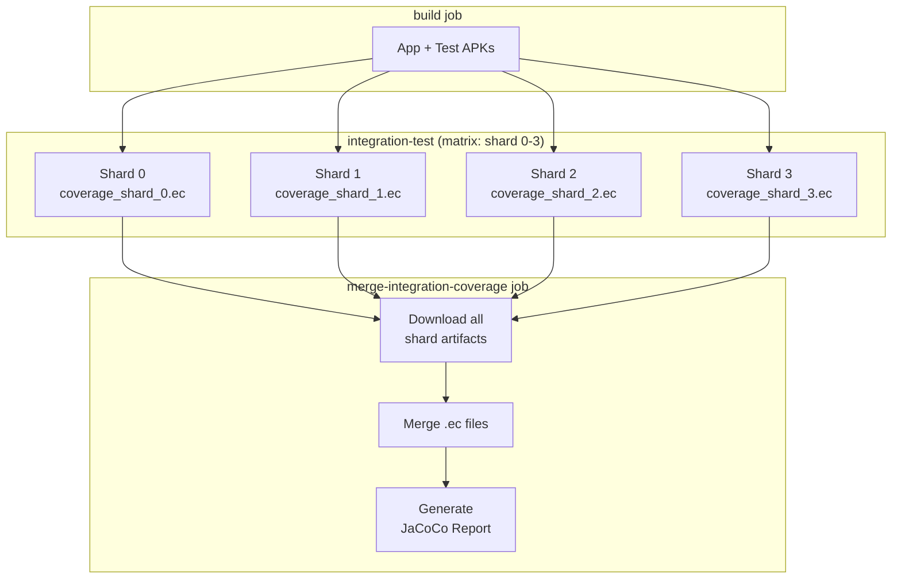

# Android Test Sharding

## Why Sharding?

Android instrumentation tests run sequentially on a single emulator, which can take 60+ minutes in CI. Test sharding distributes tests across multiple parallel emulators, significantly reducing total execution time while still producing a complete code coverage report.

## How It Works

### Architecture



### Android Test Sharding Mechanism

Android's `am instrument` command supports native test sharding via two flags:

- `-e numShards N` - Total number of shards
- `-e shardIndex I` - Which shard to run (0-indexed)

When these flags are provided, the test runner automatically distributes tests across shards. Tests are divided deterministically (typically alphabetically by class name), ensuring each test runs in exactly one shard.

### Coverage Merging

Each shard produces its own JaCoCo execution data file (`.ec`). These files are:
1. Named uniquely per shard: `coverage_shard_0.ec`, `coverage_shard_1.ec`, etc.
2. Uploaded as separate artifacts
3. Downloaded and merged in the `merge-integration-coverage` job
4. JaCoCo automatically merges multiple `.ec` files when generating the report

## Usage

### Running Sharded Tests Locally

```bash
# Run shard 0 of 4 shards
./scripts/matrix_run_android_tests.sh --shard-index 0 --num-shards 4

# Using environment variables
SHARD_INDEX=1 NUM_SHARDS=4 ./scripts/matrix_run_android_tests.sh

# Run all tests (no sharding)
./scripts/matrix_run_android_tests.sh
```

### Script Parameters

| Flag | Env Var | Default | Description |
|------|---------|---------|-------------|
| `--shard-index` | `SHARD_INDEX` | - | Which shard to run (0-indexed) |
| `--num-shards` | `NUM_SHARDS` | - | Total number of shards |
| `--arch` | `ARCH` | `x86_64` | Build architecture |
| `--module` | `MODULE` | `app` | Gradle module name |
| `--timeout` | `TEST_TIMEOUT` | `30m` | Test execution timeout |
| `--single-test` | `SINGLE_TEST` | - | Run specific test class/method |
| `--help` | - | - | Show usage |

### Running a Single Test

```bash
# Run specific test method
./scripts/matrix_run_android_tests.sh --single-test com.example.MyTest#testMethod

# Run all tests in a class
./scripts/matrix_run_android_tests.sh --single-test com.example.MyTest
```

## CI Workflow

The GitHub Actions workflow is configured with 4 shards by default:

```yaml
strategy:
  matrix:
    shard: [0, 1, 2, 3]
```

### Jobs Flow

1. **build** - Builds app and test APKs
2. **integration-test** (x4 parallel) - Each shard runs ~25% of tests
3. **merge-integration-coverage** - Collects all coverage data, generates JaCoCo report
4. **coverage-report** - Processes combined coverage for PR comments

### Adjusting Shard Count

To change the number of shards, update two places in `.github/workflows/actions.yml`:

1. The matrix definition:
   ```yaml
   matrix:
     shard: [0, 1, 2, 3, 4, 5]  # For 6 shards
   ```

2. The `NUM_SHARDS` environment variable:
   ```yaml
   env:
     NUM_SHARDS: 6
   ```

**Trade-offs:**
- More shards = faster execution, but more CI minutes (parallel)
- Fewer shards = slower execution, but fewer emulator startup overheads
- Recommended: 2-6 shards depending on test suite size

## Troubleshooting

### Uneven Shard Distribution

Android distributes tests alphabetically by class name. If some tests are much slower, shards may finish at different times. Solutions:
- Rename test classes for better distribution
- Use manual test class assignment (not implemented)

### Missing Coverage Data

If coverage files are missing from a shard:
1. Check the shard job logs for errors
2. Verify the coverage file path matches: `/data/data/{package}/files/coverage_shard_{index}.ec`
3. Check `generate_android_coverage.sh` received the correct shard index

### Coverage Report Shows Partial Data

Ensure all shards completed successfully before the merge job runs. Failed shards won't upload their coverage artifacts.

## Related Files

- `scripts/matrix_run_android_tests.sh` - Main test runner with sharding support
- `scripts/generate_android_coverage.sh` - Pulls coverage data from device
- `.github/workflows/actions.yml` - CI workflow with sharding configuration

