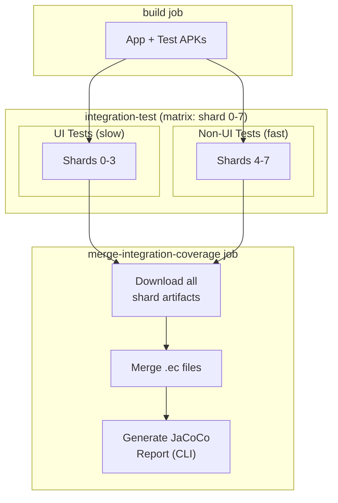

# Android Test Sharding

## Why Sharding?

Android instrumentation tests run sequentially on a single emulator, which can take 60+ minutes in CI. Test sharding distributes tests across multiple parallel emulators, significantly reducing total execution time while still producing a complete code coverage report.

## Smart Sharding Strategy

UI tests (in `com.github.quarck.calnotify.ui`) are significantly slower than other tests. To optimize parallel execution, we use **smart sharding**:

| Shard | Test Type | Internal Sharding |
|-------|-----------|-------------------|
| 0-3 | UI tests | Shard 0-3 of 4 |
| 4-7 | Non-UI tests | Shard 0-3 of 4 |

This gives UI tests 50% of parallel capacity (4 of 8 shards) despite being a smaller portion of the test count, because they take longer to run.

> **History: 8 → 4 → 8.** 8 shards were first tried in #105 (Dec 2025) and dropped after the shard jobs kept hitting their 15-minute timeout. They didn't crash or fail tests. The emulator was then the heavy `7.6in Foldable` profile with 2 GB; a 4-shard run on it timed out too, so the profile was the likelier cause. Back on 8 in #310 (Oct 2026), on `Nexus 5X` with 4 GB and after the CI flakes were root-caused (#285, #286, #289, #294, #297). A shard is ~30 s setup + ~50 s emulator boot + ~15 s APK install + its share of the tests, so going from 4 to 8 cut the slowest shard from ~6.4 to ~5 min. Runners don't queue at this size (repo is public; max wait ~0.6 min).

## How It Works

### Architecture


```mermaid
flowchart TB
    subgraph BuildJob["build job"]
        APK["App + Test APKs"]
    end
    
    subgraph ParallelShards["integration-test (matrix: shard 0-7)"]
        direction LR
        subgraph UIShards["UI Tests (slow)"]
            S0["Shards 0-3"]
        end
        subgraph NonUIShards["Non-UI Tests (fast)"]
            S1["Shards 4-7"]
        end
    end
    
    subgraph MergeJob["merge-integration-coverage job"]
        Download["Download all<br/>shard artifacts"]
        Merge["Merge .ec files"]
        JaCoCo["Generate JaCoCo<br/>Report (CLI)"]
        Download --> Merge --> JaCoCo
    end
    
    APK --> S0 & S1
    S0 & S1 --> Download
```

### Android Test Sharding Mechanism

Android's `am instrument` command supports native test sharding via two flags:

- `-e numShards N` - Total number of shards
- `-e shardIndex I` - Which shard to run (0-indexed)

Combined with package filtering:
- `-e package com.github.quarck.calnotify.ui` - Run only UI tests
- `-e notPackage com.github.quarck.calnotify.ui` - Run only non-UI tests

The script automatically maps the global shard index to the appropriate package filter and internal shard index.

### Coverage Merging

Each shard produces its own JaCoCo execution data file (`.ec`). These files are:
1. Named uniquely per shard: `coverage_shard_0.ec`, `coverage_shard_1.ec`, etc.
2. Uploaded as separate artifacts
3. Downloaded and merged in the `merge-integration-coverage` job
4. JaCoCo automatically merges multiple `.ec` files when generating the report

## Usage

### Running Sharded Tests Locally

```bash
# Run shard 0 of 8 shards
./scripts/matrix_run_android_tests.sh --shard-index 0 --num-shards 8

# Using environment variables
SHARD_INDEX=1 NUM_SHARDS=8 ./scripts/matrix_run_android_tests.sh

# Run all tests (no sharding)
./scripts/matrix_run_android_tests.sh
```

### Script Parameters

| Flag | Env Var | Default | Description |
|------|---------|---------|-------------|
| `--shard-index` | `SHARD_INDEX` | - | Which shard to run (0-indexed) |
| `--num-shards` | `NUM_SHARDS` | - | Total number of shards |
| `--arch` | `ARCH` | `x86_64` | Build architecture |
| `--module` | `MODULE` | `app` | Gradle module name |
| `--timeout` | `TEST_TIMEOUT` | `30m` | Test execution timeout |
| `--help` | - | - | Show usage |

## CI Workflow

The GitHub Actions workflow is configured with 8 shards:

```yaml
strategy:
  matrix:
    shard: [0, 1, 2, 3, 4, 5, 6, 7]
```

### Jobs Flow

1. **build** - Builds app and test APKs
2. **integration-test** (x8 parallel) - Each shard runs ~12.5% of tests
3. **merge-integration-coverage** - Collects all coverage data, generates JaCoCo report
4. **coverage-report** - Processes combined coverage for PR comments

### Adjusting Shard Count

To change the number of shards, update two places in `.github/workflows/actions.yml`:

1. The matrix definition:
   ```yaml
   matrix:
     shard: [0, 1, 2, 3, 4, 5, 6, 7, 8, 9]  # For 10 shards
   ```

2. The `NUM_SHARDS` environment variable:
   ```yaml
   env:
     NUM_SHARDS: 10
   ```

**Trade-offs:**
- More shards = faster execution, but each adds ~1.5 min of fixed setup/boot/install and another concurrent job
- Fewer shards = slower execution, fewer concurrent jobs
- Current config: 8 shards (see the history note above)

### Adjusting UI vs Non-UI Shard Ratio

`UI_SHARD_COUNT` in `scripts/matrix_run_android_tests.sh` is derived as half of `NUM_SHARDS`, so changing the shard count only touches the workflow:

```bash
UI_SHARD_COUNT=$(( ${NUM_SHARDS:-0} / 2 ))  # Shards dedicated to UI tests
```

With 8 total shards:
- Shards 0-3: UI tests
- Shards 4-7: Non-UI tests

To use a different ratio, replace that derivation with a fixed number.

## Troubleshooting

### Uneven Shard Distribution

Within each test type (UI vs non-UI), Android distributes tests alphabetically by class name. The smart sharding strategy already addresses the main imbalance (slow UI tests), but within each category, shards may still finish at different times.

### Missing Coverage Data

If coverage files are missing from a shard:
1. Check the shard job logs for errors
2. Verify the coverage file path matches: `/data/data/{package}/files/coverage_shard_{index}.ec`
3. Check `generate_android_coverage.sh` received the correct shard index

### Coverage Report Shows Partial Data

Ensure all shards completed successfully before the merge job runs. Failed shards won't upload their coverage artifacts.

## CI Performance Optimizations

Integration test shards use `test_runner_only` mode in the CI workflow, which significantly speeds up job startup:

**What gets skipped:**
- Node.js/Yarn setup
- JS bundle generation
- Gradle caches
- React Native caches
- Disk space cleanup

**What's kept:**
- JDK setup (for adb)
- Android SDK/emulator setup

This reduces Common Setup time from ~4 min to ~2 min per shard.

See [GitHub Actions Performance](../dev_completed/github_actions_performance.md) for full details on CI optimization.

## Related Files

- `scripts/matrix_run_android_tests.sh` - Main test runner with sharding support
- `scripts/generate_android_coverage.sh` - Pulls coverage data from device
- `.github/workflows/actions.yml` - CI workflow with sharding configuration
- `.github/actions/common-setup/action.yml` - Common setup with `test_runner_only` option

